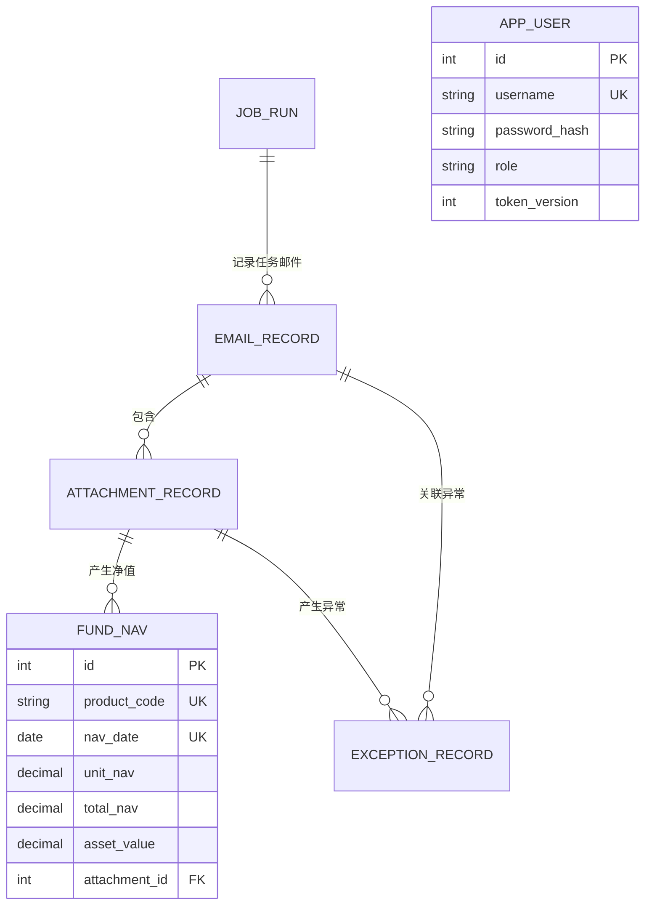

# 基金运营邮件自动解析与净值汇总系统

本项目用于自动读取基金净值邮件、归档并解析 Excel 附件、标准化净值数据、识别异常并生成每日汇总。

当前进度：

- 阶段 1（需求分析与架构设计）已完成，详见 [docs/stage-1-design.md](docs/stage-1-design.md)。
- 阶段 2（FastAPI 后端基础框架）已完成。
- 阶段 3（IMAP 邮件读取与附件归档）已完成。
- 阶段 4（Excel 智能识别与净值标准化）已完成。
- 阶段 5（SQLite 数据存储与幂等导入）已完成。
- 阶段 6（每日净值与异常 Excel 导出）已完成。
- 阶段 7（Vue 运营后台、登录认证与人工重解析）已完成。

## 使用教程

以下命令均在 Windows PowerShell 中执行。首次使用需要完成配置、数据库迁移和管理员创建；以后启动时只需要分别启动后端和前端。

### 1. 配置邮箱

编辑 `config/config.yaml` 中的邮箱连接信息：

```yaml
email:
  host: imap.example.com
  port: 993
  username: operations@example.com
  auth_mode: password
  use_ssl: true
  start_tls: false
```

在项目根目录的 `.env` 中填写邮箱授权码。QQ 企业邮箱等通常应使用授权码，而不是网页登录密码：

```dotenv
FUND_NAV_EMAIL__PASSWORD=你的邮箱授权码
```

Outlook / Microsoft 365 使用 OAuth2 时，参见下文“邮箱配置与人工同步”。

### 2. 初始化数据库和管理员

进入项目根目录：

```powershell
Set-Location "C:\Users\yyh01\Documents\Email"
```

执行数据库迁移：

```powershell
.\.venv\Scripts\python.exe -m alembic -c backend\alembic.ini upgrade head
```

创建管理员账号。系统没有默认账号或默认密码，密码由你在终端中输入两次：

```powershell
.\.venv\Scripts\python.exe -m app.cli.create_admin --username admin
```

管理员已经创建过时，不需要重复执行该命令。

### 3. 启动系统

打开第一个 PowerShell 窗口，启动后端：

```powershell
Set-Location "C:\Users\yyh01\Documents\Email"
.\.venv\Scripts\python.exe -m uvicorn app.main:app --app-dir backend --reload
```

打开第二个 PowerShell 窗口，启动前端：

```powershell
Set-Location "C:\Users\yyh01\Documents\Email\frontend"
pnpm.cmd dev
```

浏览器访问 <http://127.0.0.1:5173>，使用刚创建的管理员账号登录。后端 API 文档位于 <http://127.0.0.1:8000/docs>。

登录后进入“邮件管理”，页面顶部会展示后端实际加载的邮箱服务器、端口、账号、认证方式、加密方式和邮箱目录。管理员或运营账号可点击“检测连接”，系统只执行 IMAP 建连、认证和只读目录选择，不读取邮件正文，也不会改变邮件已读状态。授权码和 OAuth2 令牌不会返回浏览器。连接正常后点击“立即同步”，系统才会搜索、匹配、归档并解析最近邮件；连接检测本身不会导入邮件。

停止系统时，在两个 PowerShell 窗口中分别按 `Ctrl+C`。

### 4. 处理一批基金净值邮件

需要立即读取一次邮箱时，在项目根目录执行：

```powershell
.\.venv\Scripts\python.exe -m app.cli.mail_sync
```

同步完成后的推荐操作顺序：

1. 在“运营概览”确认今日邮件数、解析成功数和待处理异常。
2. 在“邮件管理”先检测邮箱连接，再查看每封邮件的归档与解析状态；点击“查看”可打开邮件正文和附件清单。
3. 在“基金净值”按产品或日期查询数据，并检查历史净值曲线。
4. 在“异常管理”复核缺字段、空净值、重复数据和格式错误；点击异常右侧“查看”可核对其原始邮件。
5. 附件解析失败时，在“人工处理”上传原 Excel 重新解析。
6. 在“基金净值”页面选择业务日期并导出每日汇总 Excel。

也可以通过命令行导出指定日期：

```powershell
.\.venv\Scripts\python.exe -m app.cli.export_daily --date 2026-07-24
```

### 5. 数据文件位置

系统不会覆盖原始邮件和历史净值。运行数据默认位于：

```text
data/
├── fund_nav.db                    # SQLite 数据库
└── YYYY/MM/DD/
    ├── emails/                    # 原始邮件
    ├── attachments/               # 原始及人工上传附件
    └── exports/                   # 每日基金净值汇总.xlsx
```

### 6. 常见问题

- PowerShell 提示 `pnpm.ps1 cannot be loaded`：使用 `pnpm.cmd dev`，不需要降低 PowerShell 安全策略。
- 登录提示用户名或密码错误：确认已经执行管理员创建命令；系统不存在默认密码。
- 邮箱认证失败：优先检查 IMAP 是否已启用、授权码是否正确，以及 `use_ssl` 与 `start_tls` 是否配置冲突。
- QQ 邮箱连接提示“账号或授权码验证失败”：在 QQ 邮箱设置中启用 IMAP 服务并重新生成授权码，将新授权码写入 `.env` 的 `FUND_NAV_EMAIL__PASSWORD`，然后重启后端。
- 页面打不开：确认后端 `8000` 端口和前端 `5173` 端口的两个进程都仍在运行。
- Excel 没有入库：前往“异常管理”查看缺失字段或格式识别信息，不要直接修改数据库。

## 后端本地运行

要求 Python 3.11 或 3.12。

```powershell
python -m venv .venv
.\.venv\Scripts\python.exe -m pip install -e ".\backend[dev]"
if (!(Test-Path ".env")) { Copy-Item ".env.example" ".env" }
.\.venv\Scripts\python.exe -m alembic -c backend\alembic.ini upgrade head
.\.venv\Scripts\python.exe -m app.cli.create_admin --username admin
.\.venv\Scripts\python.exe -m uvicorn app.main:app --app-dir backend --reload
```

服务启动后可访问：

- API 文档：<http://127.0.0.1:8000/docs>
- 存活检查：<http://127.0.0.1:8000/api/v1/health/live>
- 就绪检查：<http://127.0.0.1:8000/api/v1/health/ready>

运行测试：

```powershell
.\.venv\Scripts\python.exe -m pytest backend/tests
```

配置默认从 `config/config.yaml` 读取。生产环境中的密码等敏感值应通过环境变量注入，环境变量前缀为 `FUND_NAV_`，嵌套字段使用双下划线，例如 `FUND_NAV_EMAIL__PASSWORD`。管理员创建命令会交互式读取密码，不会把密码写入命令历史。

## 前端本地运行

要求 Node.js 22 或 24、pnpm 11。先启动后端，再在另一个 PowerShell 窗口执行：

```powershell
Set-Location frontend
pnpm.cmd install
pnpm.cmd dev
```

浏览器访问 <http://127.0.0.1:5173>。Vite 会把 `/api` 请求代理到本机 `8000` 端口；登录状态保存在服务端签名的 HttpOnly Cookie 中，前端不会把账号或令牌写入浏览器本地存储。

生产构建与前端测试：

```powershell
Set-Location frontend
pnpm.cmd type-check
pnpm.cmd test
pnpm.cmd build
```

## 邮箱配置与人工同步

通用 IMAP、QQ 企业邮箱等使用授权码时：

```yaml
email:
  host: imap.example.com
  port: 993
  username: operations@example.com
  auth_mode: password
  password: ""
  use_ssl: true
  start_tls: false
```

Outlook / Microsoft 365 若租户要求现代认证，可将 `auth_mode` 改为 `oauth2`，并通过 `FUND_NAV_EMAIL__OAUTH2_ACCESS_TOKEN` 注入访问令牌。访问令牌的申请和刷新由企业身份平台负责，本系统不会把令牌写入归档或日志。

执行一次邮箱同步：

```powershell
.\.venv\Scripts\python.exe -m app.cli.mail_sync
```

同步过程不会修改邮件已读状态。候选邮件先按主题、附件名和 Excel 扩展名初筛，再归档到 `data/YYYY/MM/DD`；归档成功后会验证附件 SHA-256，调用阶段 4 解析器并把净值与异常写入数据库。

## Excel 格式兼容

解析器不依赖附件名称判断业务类型，而是扫描每个工作表前部的 1～3 行候选表头，根据字段命中情况和托管特征字段评分。当前支持：

- 单基金每日净值表
- 多基金汇总净值表
- 基金资产净值浏览表
- `.xlsx` 和历史 `.xls`
- 标题行、空行、多行表头、跨行拆分字段
- 全半角、换行、括号和“元”等单位差异
- 日期字符串、Excel日期序号和日期单元格
- 千分位、货币符号、括号负数和高精度Decimal
- 多工作表分别识别
- 缺字段、格式歧义、日期错误、数值错误、净值为空和文件内重复记录

不同托管平台的字段名称通过 [config/excel_fields.yaml](config/excel_fields.yaml) 维护。新增托管格式时，应添加经过确认的精确别名；无法唯一识别的格式会进入异常记录，不会猜测入库。

## 数据库与幂等规则

SQLite 默认文件为 `data/fund_nav.db`，当前迁移版本为 `20260729_0002`。核心表包括：

- `fund_nav`：标准化净值，数据库唯一键为 `product_code + nav_date`
- `email_record`：邮箱、UIDVALIDITY、UID、主题、发送人与处理状态
- `attachment_record`：附件原名、归档路径、SHA-256 与解析状态
- `exception_record`：格式、字段、重复、文件完整性等运营异常
- `job_run`：定时任务与人工任务的执行审计
- `app_user`：Web 后台账号、角色和会话失效版本

净值写入仅提供新增语义，不提供覆盖接口。基金代码入库前会去除首尾空格并统一转成大写；同一产品代码和日期再次导入时，系统保留首次记录，并新增 `duplicate_nav` 异常。每个附件的净值、异常与状态在同一事务中提交，任一步骤失败会整体回滚。

迁移检查：

```powershell
.\.venv\Scripts\python.exe -m alembic -c backend\alembic.ini current
.\.venv\Scripts\python.exe -m alembic -c backend\alembic.ini check
```

阶段 5 的详细设计与验证见 [docs/stage-5-storage.md](docs/stage-5-storage.md)。

## 每日 Excel 汇总导出

导出指定业务日期：

```powershell
.\.venv\Scripts\python.exe -m app.cli.export_daily --date 2026-07-24
```

省略 `--date` 时，系统使用 `storage.archive_timezone` 配置的本地日期。报表保存到：

```text
data/YYYY/MM/DD/exports/每日基金净值汇总.xlsx
```

Web“基金净值”页面的导出日期规则与 CLI 略有不同，更适合托管邮件延迟到达的运营场景：

1. 已选择估值日期区间：使用区间结束日期（只有一个日期时使用该日期）。
2. 未选择估值日期：通过 `GET /api/v1/fund-nav/latest-date` 查询数据库中最大的 `fund_nav.nav_date`。
3. 数据库没有任何净值：禁用导出按钮并显示“暂无可导出净值”，不会回退到电脑当天日期生成空报表。

例如邮件在 `2026-08-03` 收到，但附件估值日为 `2026-07-31`，未选择日期时页面默认导出 `2026-07-31`。

工作簿包含：

- `基金净值`：日期、产品代码、产品名称、单位净值、累计净值、资产净值和来源
- `异常记录`：日期缺失、产品重复、净值为空、格式错误、文件异常等审计明细

同一天重新导出时使用临时文件和原子替换。只有新文件完整保存后才会替换旧报表；构建失败时旧文件保持不变。导出文件名可通过 `storage.daily_export_filename` 配置，详细说明见 [docs/stage-6-export.md](docs/stage-6-export.md)。

## Web 运营后台

阶段 7 提供以下页面：

- 运营概览：今日邮件、解析成功、基金数量、待处理异常与最新净值批次
- 邮件管理：按关键词、收件日期和状态查询邮件审计记录，并安全预览原邮件或下载 `.eml` 归档
- 基金净值：按产品与日期查询、导出日报、查看单产品历史净值曲线；产品筛选以下拉框展示数据库中已有历史净值的全部基金，同一基金的普通份额及 A/B/C 类份额归入同一分组并相邻排列
- 异常管理：分类筛选、查看异常关联的原始邮件，并由运营人员完成解决、忽略或重新打开
- 人工处理：上传失败的 `.xls` / `.xlsx` 重新解析，文件与操作记录独立归档

账号分为 `admin`、`operator` 和 `viewer`。只读账号可以查询数据，但不能处置异常或执行人工重解析。前端采用业务模块注册机制，基金运营只是当前第一个模块；后续可通过独立模块接入对账、份额登记、指令管理等运营能力。详细说明见 [docs/stage-7-web.md](docs/stage-7-web.md)。

---

## 项目代码结构与模块说明

本节是当前仓库的代码交接地图，描述的是已经存在的代码，而不是规划中的功能。`.venv/`、`frontend/node_modules/`、`frontend/dist/`、`data/`、`logs/` 等运行生成目录不属于业务源代码，因此不在源代码树中展开。

### 当前实现边界

| 能力 | 当前状态 | 入口 |
| --- | --- | --- |
| IMAP 邮箱连接、连接检测 | 已实现 | `email/imap_client.py`、`services/email_connection_service.py` |
| 手工立即同步邮箱 | 已实现 | `POST /api/v1/emails/sync`、`cli/mail_sync.py` |
| MIME 邮件及附件提取 | 已实现 | `email/mime_parser.py` |
| EML、附件、清单归档 | 已实现 | `services/archive_service.py` |
| XLS/XLSX 智能识别与标准化 | 已实现 | `parsers/` |
| SQLite 持久化及幂等控制 | 已实现 | `db/`、`repositories/`、`services/persistence_service.py` |
| 日报 Excel 导出 | 已实现 | `services/export_service.py`、`exports/` |
| Web 登录及运营后台 | 已实现 | `api/`、`frontend/src/` |
| 异常邮件正文查看及 EML 下载 | 已实现 | `services/email_detail_service.py`、`EmailDetailDialog.vue` |
| 人工上传重新解析 | 已实现 | `services/manual_reparse_service.py` |
| APScheduler 自动定时执行 | **尚未接入运行器**；当前只有 `scheduler` 配置模型 | 后续阶段 |
| Docker Compose 部署 | **尚未实现**；仓库当前没有 Dockerfile 或 `docker-compose.yml` | 后续阶段 |

### 总体架构


系统按分层方式组织：

- `email` 只负责 IMAP、MIME 和同步过程中的轻量对象，不理解基金净值业务。
- `parsers` 只负责读取 Excel、识别表格和生成标准记录，不直接写数据库。
- `services` 编排跨模块业务流程和事务。
- `repositories` 封装可复用的数据查询及插入规则。
- `db/models` 定义数据库实体、唯一约束和关联关系。
- `api` 把服务暴露为 HTTP 接口，并执行登录、权限与参数校验。
- `frontend` 调用 HTTP 接口，不直接访问 SQLite 或归档目录。

### 完整目录树

```text
Email/
├── README.md                              # 项目总说明、使用教程、代码地图和数据流
├── .env.example                           # 敏感环境变量示例；真实 .env 不提交
├── .gitignore                             # 忽略密钥、数据库、日志、依赖和构建产物
├── config/
│   ├── config.yaml                        # 当前本机非敏感运行配置
│   ├── config.example.yaml                # 可复制的生产配置模板
│   └── excel_fields.yaml                  # Excel 标准字段别名和三类工作簿识别规则
├── docs/
│   ├── stage-1-design.md                  # 阶段1架构与数据库设计
│   ├── stage-5-storage.md                 # 阶段5持久化、事务和幂等说明
│   ├── stage-6-export.md                  # 阶段6日报导出说明
│   └── stage-7-web.md                     # 阶段7前端、权限和模块扩展说明
├── data/                                  # 运行数据；不提交业务文件
│   ├── fund_nav.db                        # SQLite 数据库
│   ├── .email_uid_state/                  # IMAP UID 处理中/已完成幂等标记
│   └── YYYY/MM/DD/
│       ├── emails/                        # 原始 .eml 和邮件 JSON 审计清单
│       ├── attachments/                   # 原始附件与人工上传附件
│       └── exports/                       # 每日基金净值汇总.xlsx
├── logs/
│   └── backend.log                        # JSON 格式、按大小滚动的后端日志
├── backend/
│   ├── pyproject.toml                     # Python 依赖、pytest 和 Ruff 配置
│   ├── alembic.ini                        # Alembic 数据库迁移入口配置
│   ├── README.md                          # 后端简要说明
│   ├── alembic/
│   │   ├── env.py                         # 把 SQLAlchemy metadata 和运行配置交给 Alembic
│   │   ├── script.py.mako                 # 新迁移脚本模板
│   │   └── versions/
│   │       ├── 20260728_0001_initial_schema.py  # 建立核心业务表、索引和约束
│   │       └── 20260729_0002_user_roles.py      # 增加用户角色及令牌版本
│   ├── app/
│   │   ├── __init__.py                    # 后端包版本
│   │   ├── main.py                        # FastAPI 应用工厂、生命周期、中间件和总路由
│   │   ├── api/
│   │   │   ├── __init__.py                # API 包标记
│   │   │   ├── deps.py                    # 数据库会话、当前用户和角色权限依赖
│   │   │   ├── schemas/
│   │   │   │   ├── __init__.py            # Schema 包标记
│   │   │   │   ├── auth.py                # 登录、用户和会话响应结构
│   │   │   │   ├── common.py              # 通用分页响应结构
│   │   │   │   ├── email_connection.py    # 邮箱配置、连接检测和同步统计响应
│   │   │   │   ├── email_detail.py        # 邮件正文和附件详情响应
│   │   │   │   └── operations.py          # 概览、邮件、净值、异常、重解析响应
│   │   │   └── v1/
│   │   │       ├── __init__.py            # v1 路由包标记
│   │   │       ├── router.py              # 汇总所有 `/api/v1` 子路由
│   │   │       ├── auth.py                # 登录、退出、当前用户
│   │   │       ├── health.py              # 存活和数据库就绪检查
│   │   │       ├── dashboard.py           # 运营概览指标
│   │   │       ├── emails.py              # 邮箱检测、同步、邮件列表、正文和 EML 下载
│   │   │       ├── fund_nav.py            # 净值查询、产品搜索、历史曲线和日报下载
│   │   │       ├── exceptions.py          # 异常筛选及解决/忽略状态更新
│   │   │       └── operations.py          # 人工上传 Excel 重新解析
│   │   ├── cli/
│   │   │   ├── __init__.py                # CLI 包标记
│   │   │   ├── create_admin.py            # 创建或更新管理员账号
│   │   │   ├── mail_sync.py               # 命令行触发一次邮箱同步
│   │   │   └── export_daily.py            # 命令行导出指定业务日期日报
│   │   ├── core/
│   │   │   ├── __init__.py                # 核心基础设施包标记
│   │   │   ├── config.py                  # YAML、.env、环境变量加载及配置校验
│   │   │   ├── context.py                 # 请求上下文变量
│   │   │   ├── errors.py                  # 统一业务错误与 HTTP 错误响应
│   │   │   ├── files.py                   # 原子文件写入
│   │   │   ├── logging.py                 # JSON 日志和滚动文件配置
│   │   │   ├── middleware.py              # 请求 ID、耗时和访问日志中间件
│   │   │   └── security.py                # PBKDF2 密码散列和签名会话令牌
│   │   ├── db/
│   │   │   ├── __init__.py                # 数据库包标记
│   │   │   ├── base.py                    # SQLAlchemy Declarative Base 与命名规则
│   │   │   ├── session.py                 # Engine、SQLite PRAGMA、Session 工厂
│   │   │   ├── types.py                   # UTC 时间数据库类型
│   │   │   └── models/
│   │   │       ├── __init__.py            # 集中导出全部 ORM 模型和枚举
│   │   │       ├── app_user.py            # 后台用户
│   │   │       ├── email_record.py        # 邮件记录和附件记录
│   │   │       ├── fund_nav.py            # 标准基金净值
│   │   │       ├── exception_record.py    # 文件、字段、重复等异常
│   │   │       ├── job_run.py             # 同步、导出、人工任务审计
│   │   │       ├── enums.py               # 邮件、附件、异常、任务、角色状态枚举
│   │   │       └── mixins.py              # 创建时间和更新时间公共列
│   │   ├── domain/
│   │   │   ├── __init__.py                # 领域规则包标记
│   │   │   └── exception_categories.py    # 底层异常代码到中文运营类别的映射
│   │   ├── email/
│   │   │   ├── __init__.py                # 邮件接入包标记
│   │   │   ├── imap_client.py             # 只读 IMAP 连接、UID 搜索和完整邮件获取
│   │   │   ├── mime_parser.py             # 解析主题、发件人、Message-ID 和 MIME 附件
│   │   │   ├── models.py                  # 邮件同步过程的数据传输对象
│   │   │   └── uid_registry.py            # 文件级 UID 预留与完成标记，防止重复处理
│   │   ├── parsers/
│   │   │   ├── __init__.py                # Excel 解析包标记
│   │   │   ├── workbook_reader.py         # 根据真实文件签名选择 openpyxl 或 xlrd
│   │   │   ├── field_registry.py          # 加载字段别名、标准化表头并匹配字段
│   │   │   ├── detector.py                # 扫描多行表头并对三类工作簿评分
│   │   │   ├── normalizers.py             # 空值、文本、代码、日期、Decimal 标准化
│   │   │   ├── models.py                  # 检测结果、标准记录、解析问题等领域对象
│   │   │   ├── base.py                    # 通用行遍历、元数据回退、字段转换和校验
│   │   │   ├── single_fund.py             # 单基金每日净值表适配器
│   │   │   ├── fund_summary.py            # 多基金净值汇总表适配器
│   │   │   ├── asset_browser.py           # 基金资产净值浏览表适配器
│   │   │   └── service.py                 # 多 Sheet 解析总入口、歧义及重复行检查
│   │   ├── repositories/
│   │   │   ├── __init__.py                # 集中导出仓储对象
│   │   │   ├── email_repository.py        # 按邮箱 UID 业务键查询邮件
│   │   │   ├── fund_nav_repository.py     # 只插入净值及并发唯一冲突处理
│   │   │   ├── exception_repository.py    # 新增异常记录
│   │   │   ├── export_repository.py       # 日报净值和异常只读查询
│   │   │   └── user_repository.py         # 用户查询
│   │   ├── services/
│   │   │   ├── __init__.py                # 业务服务包标记
│   │   │   ├── email_connection_service.py    # 独立测试邮箱连接并返回脱敏结果
│   │   │   ├── email_service.py               # IMAP 搜索、UID 预留、候选筛选、归档编排
│   │   │   ├── mail_sync_runner.py            # 同步互斥锁、job_run 及完整依赖装配
│   │   │   ├── archive_service.py             # EML、附件、清单安全归档和文件名清理
│   │   │   ├── attachment_processing_service.py # 哈希复核、调用解析器和持久化
│   │   │   ├── persistence_service.py         # 邮件、附件、净值、异常事务写入及状态汇总
│   │   │   ├── email_detail_service.py        # 安全读取原始邮件并将 HTML 转成纯文本
│   │   │   ├── manual_reparse_service.py      # 人工附件归档、审计并复用统一解析链
│   │   │   ├── export_service.py              # 查询日报数据、构建工作簿、原子发布
│   │   │   └── auth_service.py                # 用户认证和账号创建
│   │   └── exports/
│   │       ├── __init__.py                # 集中导出日报构建对象
│   │       ├── models.py                  # 日报净值行和异常行传输对象
│   │       └── daily_workbook.py          # 两个 Sheet 的格式、公式防护和条件样式
│   └── tests/
│       ├── conftest.py                    # 每项测试隔离 SQLite、配置和密钥
│       ├── integration/
│       │   ├── __init__.py                # 集成测试包标记
│       │   ├── test_admin_api.py          # 登录、权限及主要运营 API 集成测试
│       │   ├── test_export_service.py     # 日报文件和任务状态集成测试
│       │   ├── test_health.py             # 健康检查与统一错误结构
│       │   ├── test_manual_reparse.py     # 人工重解析全链路测试
│       │   └── test_migrations.py         # Alembic 升级、检查和降级测试
│       └── unit/
│           ├── __init__.py                # 单元测试包标记
│           ├── test_archive_service.py    # 归档目录、附件和大小限制
│           ├── test_config.py             # 配置优先级与安全校验
│           ├── test_daily_workbook.py     # 导出 Sheet、格式和公式防注入
│           ├── test_detector.py           # 多行表头、类型评分和歧义
│           ├── test_email_connection_service.py # 邮箱连接检测
│           ├── test_email_detail_service.py     # 正文解析、HTML 安全和路径保护
│           ├── test_email_service.py      # 邮箱同步、筛选、重试和单邮件隔离
│           ├── test_excel_parser_service.py     # 三类 Excel 解析与异常
│           ├── test_field_registry.py     # 托管字段别名扩展
│           ├── test_imap_client.py        # IMAP 返回值和错误映射
│           ├── test_mime_parser.py        # MIME 附件提取
│           ├── test_normalizers.py        # 日期、数值、空值和代码标准化
│           ├── test_persistence_service.py     # 事务、幂等、哈希和状态
│           ├── test_security.py            # 密码及会话签名
│           ├── test_uid_registry.py        # UID 原子预留和过期恢复
│           └── test_workbook_reader.py     # XLS/XLSX 文件签名识别
└── frontend/
    ├── package.json                       # Vue、Vite、Element Plus、测试命令与依赖
    ├── pnpm-lock.yaml                     # 锁定前端依赖的精确版本
    ├── pnpm-workspace.yaml                # pnpm 工作区配置
    ├── vite.config.ts                     # Vite 插件、开发代理和构建配置
    ├── tsconfig*.json                     # TypeScript 项目配置
    ├── index.html                         # SPA HTML 入口
    └── src/
        ├── env.d.ts                       # Vite/Vue TypeScript 环境声明
        ├── main.ts                        # 创建 Vue、Pinia、Router、Element Plus
        ├── App.vue                        # 顶层 router-view
        ├── styles/index.css               # 全局主题、布局和响应式样式
        ├── views/LoginView.vue            # 登录页面
        ├── layouts/AppShell.vue           # 侧边栏、顶部栏、用户菜单和页面容器
        ├── router/index.ts                # 动态业务路由、登录和角色守卫
        ├── router/meta.d.ts               # Vue Router 自定义 meta 类型声明
        ├── components/
        │   ├── PageHeader.vue             # 页面标题和操作区
        │   └── StatusTag.vue              # 各类状态统一中文标签
        ├── platform/
        │   ├── api/http.ts                # Axios 实例、Cookie、401 拦截和错误消息
        │   ├── api/types.ts               # 用户、分页和错误通用类型
        │   ├── auth/auth.store.ts         # 登录、恢复会话、退出和本地用户状态
        │   └── modules/types.ts            # 可扩展业务模块契约
        └── modules/
            ├── index.ts                   # 模块注册、重复校验和路由汇总
            ├── index.spec.ts              # 模块注册机制测试
            └── fund-operations/
                ├── index.ts               # 基金运营模块导航与懒加载路由
                ├── api/index.ts           # 本模块全部后端请求函数
                ├── api/types.ts           # 邮件、净值、异常等前端类型
                ├── components/
                │   ├── EmailDetailDialog.vue # 原邮件正文、附件清单和 EML 下载
                │   └── NavHistoryChart.vue    # ECharts 历史净值曲线
                └── views/
                    ├── OverviewView.vue    # 运营概览
                    ├── EmailListView.vue   # 邮箱状态、连接检测、同步和邮件列表
                    ├── FundNavView.vue     # 净值查询、导出和历史曲线
                    ├── ExceptionListView.vue # 异常筛选、原邮件和处理状态
                    └── OperationsView.vue  # 人工上传重新解析
```

## 核心数据对象及传递边界

邮件和 Excel 在不同阶段使用不同对象，避免某一层同时承担网络、文件、解析和数据库职责。

| 对象 | 产生位置 | 包含内容 | 传递到 |
| --- | --- | --- | --- |
| `MailboxMessage` | `ImapMailboxGateway.fetch_message()` | UID、IMAP 接收时间、完整 RFC822 字节 | `MimeMessageParser` |
| `ParsedEmail` | `MimeMessageParser.parse()` | 主题、发件人、Message-ID、附件元组 | 候选判断、归档服务、数据库归档记录 |
| `EmailAttachment` | MIME 遍历 | MIME 序号、原文件名、Content-Type、解码后字节 | `EmailArchiveService` |
| `ArchivedEmail` | `EmailArchiveService.archive()` | EML 路径、清单路径、已归档附件 | `DatabaseArchiveRecorder` |
| `AttachmentRecord` | `MailArchivePersistenceService.persist()` | 文件相对路径、SHA-256、格式和解析状态 | `AttachmentProcessingService` |
| `TableDetection` | `TableDetector.detect()` | 表头位置、字段列映射、类型、分数和缺失字段 | 对应表格解析器 |
| `StandardNavRecord` | `BaseTableParser._parse_row()` | 统一净值字段及来源 Sheet/行号 | `NavPersistenceService` |
| `ParseIssue` | 读取、检测或行转换阶段 | 异常代码、字段、原值、Sheet、行号 | `ExceptionRecord` |
| `FundNav` | `NavPersistenceService.persist()` | 最终可查询的标准净值 | API、历史曲线、日报导出 |

## 邮件读取与附件提取详解（重点）

### 1. 同步入口和依赖装配

同步可以由两条入口触发：

- Web 点击“立即同步”调用 `POST /api/v1/emails/sync`。
- 命令行运行 `python -m app.cli.mail_sync`。

两个入口最终都调用 `MailSyncRunner.run(trigger_type=MANUAL)`。Runner 的职责是：

1. 获取进程内互斥锁，阻止同一后端进程并发执行两次同步。
2. 新建 `job_run`，状态设为 `running`。
3. 组装 `EmailSyncService`、`DatabaseArchiveRecorder`、`AttachmentProcessingService` 和 `ExcelParserService`。
4. 执行同步并根据成功、部分成功或失败回写 `job_run`。
5. 无论成功或异常都释放互斥锁。

### 2. IMAP 搜索与原始邮件获取

`ImapMailboxGateway` 只读访问邮箱：

```python
# 伪代码，与 imap_client.py 的实际调用顺序一致
client = IMAPClient(host, port, ssl=use_ssl)
client.login(username, password_or_oauth2_token)
client.select_folder(folder, readonly=True)       # 不改变邮件已读状态
uids = client.search(["SINCE", since_date])      # 按配置的回看天数查询
response = client.fetch([uid], [
    b"BODY.PEEK[]",                              # 获取完整邮件但不标记为已读
    b"INTERNALDATE",                             # IMAP 服务端接收时间
])
```

传递结果为：

```text
IMAP 响应
  └─ MailboxMessage
     ├─ uid: int
     ├─ internal_date: timezone-aware datetime
     └─ raw_message: bytes（完整 RFC822/MIME 邮件）
```

`mailbox_key` 由 `host + username + folder` 计算 SHA-256 摘要；它与 `UIDVALIDITY`、`UID` 共同构成邮件幂等身份。搜索结果按 UID 倒序，并受 `max_messages_per_run` 限制。

### 3. MIME 元数据和附件字节提取

真正从邮件中取出附件的代码位于 `MimeMessageParser.parse()`。其逻辑可按以下带注释版本理解：

```python
# 使用标准库 email.policy.default 解码 RFC2047 中文主题和 MIME 参数
message = BytesParser(policy=policy.default).parsebytes(source.raw_message)

# 提取邮件审计元数据；发件人优先保留纯邮箱地址
subject = str(message.get("Subject") or "").strip()
sender_header = str(message.get("From") or "").strip()
_, sender_address = parseaddr(sender_header)
sender = sender_address or sender_header
message_id = str(message.get("Message-ID") or "").strip()

attachments = []

# walk() 会递归遍历 multipart/mixed、multipart/alternative 等全部 MIME 节点
for part_index, part in enumerate(message.walk(), start=1):
    filename = part.get_filename()                 # 自动解码附件文件名
    disposition = part.get_content_disposition()  # attachment / inline / None

    # 有文件名，或明确声明 attachment，才作为附件；普通正文不进入附件列表
    if not filename and disposition != "attachment":
        continue

    # 按 Content-Transfer-Encoding 解码 base64 / quoted-printable，得到原始文件字节
    payload = part.get_payload(decode=True) or b""

    attachments.append(EmailAttachment(
        part_index=part_index,                     # 保留 MIME 顺序，生成唯一归档名
        original_name=filename or fallback_name,   # 原文件名用于审计和页面展示
        content_type=part.get_content_type(),      # 仅记录；不依赖它判断 Excel 真伪
        content=payload,                           # 后续写入磁盘的附件原始字节
    ))
```

这一阶段**不读取 Excel 单元格，也不根据附件文件名判断净值表类型**。它只把 MIME 附件安全地从邮件中拆出来。

当前附件识别边界：

- 支持普通附件，以及带文件名的 inline MIME 部件。
- 支持 MIME 标准编码的中文文件名和 Base64/Quoted-Printable 内容。
- 不解压 ZIP/RAR，也不处理加密压缩包。
- 邮件正文中的下载链接不属于附件，当前不会自动访问外部链接。
- 一个邮件可以包含多个附件，全部先提取和归档；只有 `.xls`、`.xlsx` 进入净值解析。

### 4. 候选净值邮件判断

`EmailSyncService._is_candidate()` 将主题和所有附件名拼接、转小写并去空白，然后判断：

```text
候选邮件 = 命中 candidate_keywords
        OR 至少包含一个 .xls/.xlsx 附件
```

因此，托管邮件即使主题不含“基金净值”，只要带 Excel 附件仍会进入后续字段识别。非候选邮件只写 UID 完成标记，不归档、不写 `email_record`。

### 5. UID 幂等预留

每个 UID 在处理前调用 `FileUidRegistry.reserve()`：

- 已存在 `.done.json`：判定已经处理，不再下载。
- 存在未过期 `.processing`：判定另一个任务正在处理。
- `.processing` 超过 `uid_reservation_stale_seconds`：清理后允许恢复。
- 归档和数据库处理成功后生成 `.done.json`。
- 网络或单邮件处理失败时释放 `.processing`，下次可以重试。

数据库层还有 `(mailbox_key, uid_validity, message_uid)` 唯一约束，形成“文件预留 + 数据库唯一键”两层幂等。

### 6. 原始附件归档

`EmailArchiveService.archive()` 在任何 Excel 解析之前执行：

1. 检查每个附件不超过 `max_attachment_bytes`。
2. 使用邮件接收时间转换到 `archive_timezone`，确定 `YYYY/MM/DD`。
3. 清除附件名中的路径、Windows 非法字符和保留名称。
4. 原子写入原始 `.eml`。
5. 原子写入每个附件，并计算 SHA-256。
6. 生成 JSON 清单，记录 UID、Message-ID、主题、发件人、接收时间、文件路径、大小和哈希。

归档名由 `mailbox_key + UID + MIME part_index + 安全文件名` 组成，防止相同附件名互相覆盖。

### 7. 邮件和附件审计记录

`DatabaseArchiveRecorder.record()` 首先在一个数据库事务中调用 `MailArchivePersistenceService.persist()`：

```text
ArchivedEmail
  ├─ email_record
  │  ├─ 邮箱身份、UIDVALIDITY、UID
  │  ├─ 主题、发件人、接收时间
  │  ├─ 原始 EML 相对路径
  │  └─ 初始状态 archived / failed
  └─ attachment_record（每个附件一条）
     ├─ 原文件名、归档相对路径
     ├─ SHA-256、格式
     └─ archived / unsupported
```

只有 `.xls` 和 `.xlsx` 被标记为 `archived` 并进入解析；其他附件保留为 `unsupported`，不会丢失。

## Excel 附件字段提取与标准化（重点）

### 已验证的真实邮件格式与取值优先级

2026-08-03 使用只读 IMAP 对最近邮件进行核验，并对归档目录中的华泰、中信、招商三类真实附件做了离线回放。华泰 INCOS 邮件的 MIME 结构为：

```text
multipart/mixed
├─ text/html
│  └─ 正文展示一张净值表，便于运营人员直接阅读
└─ application/octet-stream; disposition=attachment
   └─ 吉余……_SBPA11_基金每日净值表_2026-07-31.xls
```

`application/octet-stream` 只是通用二进制类型，不能据此否定附件。系统以 MIME 文件名/`Content-Disposition` 提取原始附件，再以文件扩展名和真实文件签名决定是否解析。普通 HTML 正文、Logo 和签名图片不会混入 Excel 附件集合。

当前数据取值优先级为：

1. **原始 Excel 附件是唯一自动入库的权威来源**，保留文件哈希、Sheet 和原始行号，便于审计。
2. 邮件 HTML 正文中的表格用于人工查看原邮件和核对，不重复入库，避免正文与附件的相同记录触发重复数据。
3. 主题和附件文件名只用于候选邮件初筛，**不用于判断工作簿类型，也不用于补写净值字段**。
4. 工作簿类型和字段映射只依据 Excel 内部表头证据；缺少必需字段时记录异常，不从文件名猜值。

截图所示华泰五列格式映射如下：

| 原始表头 | 标准字段 | 示例值 |
| --- | --- | --- |
| 日期 | `nav_date` | `2026-07-31` |
| 资产代码 | `product_code` | `SBPA11` |
| 资产名称 | `product_name` | 吉余漫衍私募证券投资基金 |
| 资产份额净值(元) | `unit_nav` | `0.7071` |
| 资产份额累计净值(元) | `total_nav` | `0.7071` |

该格式没有资产净值列，因此 `asset_value` 合法地保留为 `None`，不会从正文、文件名或其他金额字段推断。

### 1. 附件完整性复核

`AttachmentProcessingService.process()` 从数据库读取 `stored_path` 和预期 SHA-256，重新计算磁盘文件哈希：

- 文件不存在：记录 `attachment_missing`。
- 文件无法读取：记录 `attachment_read_error`。
- 哈希不一致：记录 `attachment_integrity_error`，停止解析。
- 哈希一致：调用 `ExcelParserService.parse_file()`。

该设计保证解析的是归档时记录的原始附件，而不是被替换或损坏的文件。

### 2. 根据真实文件签名选择引擎

`WorkbookReader` 不信任扩展名，而读取文件头：

| 文件头 | 判定格式 | pandas 引擎 |
| --- | --- | --- |
| `PK 03 04` | OOXML `.xlsx` | `openpyxl` |
| `D0 CF 11 E0 A1 B1 1A E1` | OLE `.xls` | `xlrd` |
| 其他 | 不支持或伪装文件 | 生成格式异常 |

所有工作表通过 `pandas.read_excel(sheet_name=None, header=None, dtype=object)` 读取。`header=None` 很重要：系统先保留原始网格，再自行寻找表头，不假设表头一定在第一行。

### 3. 字段字典

`FieldAliasRegistry` 从 `config/excel_fields.yaml` 加载别名。标准字段含义如下：

| 标准字段 | 最终字段 | 典型托管表头别名 | 是否进入 `fund_nav` |
| --- | --- | --- | --- |
| `product_name` | 产品名称 | 产品名称、产品全称、基金名称、基金全称、资产名称 | 是 |
| `product_code` | 产品代码 | 产品代码、产品编号、基金代码、基金编号、资产代码 | 是 |
| `nav_date` | 日期 | 估值基准日、估值日期、净值日期、业务日期、数据日期、日期 | 是 |
| `unit_nav` | 单位净值 | 单位净值、单位基金净值、基金单位净值、份额净值、资产份额净值 | 是 |
| `total_nav` | 累计净值 | 累计净值、累计单位净值、基金累计净值、资产份额累计净值 | 是 |
| `asset_value` | 资产净值 | 资产净值、基金资产净值、产品资产净值、净资产 | 是 |
| `asset_share` | 资产份额 | 资产份额、基金份额、产品份额、总份额、实收基金 | **仅用于识别资产浏览表，当前未写入 `fund_nav`** |

表头匹配前会执行：

1. Unicode NFKC 标准化，全角字符转为兼容形式。
2. 转小写。
3. 删除空格、换行和标点，只保留字母数字。
4. 去掉常见金额单位后缀。
5. 先进行精确别名匹配，再进行受限的“表头以别名结尾”匹配。

新增托管平台时，应优先在 `excel_fields.yaml` 增加经过真实样本确认的精确别名，不要在代码里写死托管机构名称。

### 4. 多行表头扫描

`TableDetector.detect()` 对每个 Sheet 执行：

```text
扫描前 header_scan_rows 行（默认 40）
  × 每个起始行
  × 1 到 max_header_rows 行组合（默认最多 3 行）
  × 前 max_columns 列（默认 100）
      ↓
把同一列的多行文本分别匹配，并额外尝试拼接后匹配
      ↓
产生 field_name -> FieldColumn 映射
      ↓
对三种 WorkbookType 计算完整度、签名命中和置信度
```

`FieldColumn` 保留列号、原表头、命中的别名和匹配强度。后续读数据行时完全依据该列映射，不依赖固定列序号。

### 5. 三类工作簿识别规则

| 类型 | 必需标准字段 | 可选字段 | 主要签名 |
| --- | --- | --- | --- |
| `single_fund_daily` | 产品代码、产品名称、单位净值 | 日期、累计净值、资产净值 | 资产代码、资产名称、资产份额净值 |
| `fund_nav_summary` | 产品代码、产品名称、日期、单位净值 | 累计净值、资产净值 | 估值基准日 |
| `asset_nav_browser` | 产品代码、产品名称、日期、资产净值、资产份额 | 单位净值、累计净值 | 资产净值、资产份额 |

评分规则优先选择“必需字段全部齐全”的候选，其次比较字段命中数量和签名。如果两个完整类型分数差小于 `ambiguity_score_delta`，系统拒绝猜测并记录 `ambiguous_format`。

### 6. 表头上方元数据回退

有些单基金表把产品信息放在数据表头上方，例如：

```text
产品代码：SAWK26
产品名称  吉余宸锋金炜幸福一号私募证券投资基金
日期      2026-07-24

单位净值 | 累计净值 | 资产净值
```

`BaseTableParser._extract_metadata()` 会扫描正式表头之前的单元格，只提取：

- `product_code`
- `product_name`
- `nav_date`

支持“标签：值”位于同一单元格，也支持标签右侧相邻单元格存放值。解析每一行时，数据行字段优先，空缺时才回退到元数据。

### 7. 数据行提取

每个有效 Sheet 由对应解析器调用基类逻辑：

```python
# 根据表头检测结果，从动态列号提取当前行
raw_data = {
    field_name: frame.iat[row_index, field_column.column_index]
    for field_name, field_column in detection.field_columns.items()
}

# 行内值优先；产品代码、名称、日期可以回退到表头上方元数据
product_code = normalize_identifier(raw_or_metadata_product_code)
product_name = normalize_text(raw_or_metadata_product_name)
nav_date = parse_date(raw_or_metadata_nav_date)

# 数值统一转 Decimal，避免浮点金额误差
unit_nav = parse_decimal(raw_data.get("unit_nav"))
total_nav = parse_decimal(raw_data.get("total_nav"))
asset_value = parse_decimal(raw_data.get("asset_value"))

# 生成统一记录，同时保留文件、Sheet、原始行号和识别类型
record = StandardNavRecord(...)
```

遍历过程还会：

- 跳过完全空行，连续空行达到 `max_consecutive_blank_rows` 后停止。
- 跳过表格中间重复出现的表头。
- 跳过“合计、总计、说明、备注、制表人、复核人”等汇总/签字行，并允许后续继续识别数据。
- 任一已映射单元格以 `footer_markers` 中的“声明、免责声明、风险提示”等标记开头时，立即结束当前数据区。中信附件的数据行后会直接拼接长篇声明，这条规则可防止声明被误判为基金记录。
- 保存 Excel 的 1 基行号，异常页面可以定位原表行。

页脚标记可在 `config/config.yaml` 的 `excel.footer_markers` 中维护。匹配要求标记后是冒号、空格、换行或文本结束，例如“声明：……”会命中，而普通产品名称中的相同汉字不会做任意子串匹配。

真实附件回放结果：14 个工作簿共识别 25 条净值记录，未产生无效行或解析异常。修改前，中信附件末尾的 3 个声明行会被错误记录为 `invalid_date / missing_product_code / missing_product_name / empty_nav`；新的数据边界规则已消除这些伪异常。

### 8. 日期与数值转换

`normalizers.py` 的转换规则：

- 日期支持 Python/pandas 日期对象、Excel 日期序号、`YYYYMMDD`、`YYYY-MM-DD`、`YYYY/MM/DD` 和中文年月日。
- 产品代码会去除 Excel 将纯数字代码读成的 `.0`，持久化前再去空格并转大写。
- 数值使用 `Decimal`，支持千分位、货币符号、括号负数和“元”后缀。
- 拒绝布尔值、无穷值、百分比和以 `=` 开头的公式文本。
- 空字符串、横杠、`N/A` 等统一为 `None`。

### 9. 标准记录及异常输出

每一行转换为：

```text
StandardNavRecord
├─ product_name
├─ product_code
├─ nav_date
├─ unit_nav
├─ total_nav
├─ asset_value
├─ source_file
├─ source_sheet
├─ source_row
├─ source_type
└─ create_time
```

必需内容缺失或转换失败时，同一行附带 `ParseIssue`。只要存在 ERROR，该行不会出现在 `WorkbookParseResult.records` 中，但错误位置和原值仍会写入异常表。

主要解析异常代码：

| 异常代码 | 含义 |
| --- | --- |
| `unsupported_workbook_format` | 文件签名不是支持的 XLS/XLSX |
| `workbook_read_error` | pandas/openpyxl/xlrd 无法读取 |
| `empty_workbook` | 工作簿或识别后的数据为空 |
| `header_not_found` | 所有 Sheet 都没有可识别表头 |
| `ambiguous_format` | 两种格式同时高分，系统停止猜测 |
| `missing_field` | 类型规则要求的列缺失 |
| `missing_date` | 净值日期缺失 |
| `missing_product_code` | 产品代码缺失 |
| `missing_product_name` | 产品名称缺失 |
| `empty_nav` | 单位净值为空 |
| `invalid_date` | 日期格式无法转换 |
| `invalid_number` | 净值或资产值无法转换 |
| `duplicate_row` | 同一工作簿内产品代码和日期重复 |
| `mixed_workbook_types` | 一个工作簿的多个 Sheet 属于不同类型 |

## 净值持久化、幂等与状态传递

### 附件级事务

`NavPersistenceService.persist()` 要求调用方在 `with session.begin()` 中执行。一份附件的状态、净值和解析异常作为同一事务提交；出现未处理异常时整体回滚，避免“净值写了一半但状态显示成功”。

净值写入前执行：

1. 产品代码去空格并转大写。
2. 用 `(product_code, nav_date)` 查询已有记录。
3. 不存在则在数据库保存点内插入。
4. 并发触发唯一约束时只回滚保存点，再查询已存在记录。
5. 重复数据不覆盖历史净值，写入 `duplicate_nav` 异常。

`FundNavRepository` 故意不提供覆盖更新接口，数据库也有唯一约束，双重保证历史不被静默覆盖。

### 状态汇总

```text
附件 archived
  └─ 开始解析 → parsing
      ├─ 全部有效并有新增数据 → success
      ├─ 有新增数据且存在错误 → partial_success
      ├─ 全部是重复数据 → duplicate
      └─ 无新增数据且解析失败 → failed

一封邮件的所有附件状态
  └─ _refresh_email_status()
      ├─ success + unsupported → 邮件 success
      ├─ 至少一个 success/partial_success 且还有错误 → partial_success
      ├─ 所有可处理附件均结束且均失败/重复 → failed
      └─ 尚有 archived/pending/parsing → processing
```

异常通过 `email_id` 和 `attachment_id` 回链原始邮件及附件，所以异常管理页面能够打开对应邮件。

## 人工重新解析数据流


人工上传不会覆盖原附件；系统创建独立任务、邮件审计记录和新附件记录。可选的 `source_attachment_id` 只用于说明替代来源，最终仍遵守 `(产品代码, 日期)` 唯一规则。

## 原始邮件查看数据流

邮件列表或异常列表点击“查看”后：

1. `EmailDetailDialog.vue` 调用 `GET /api/v1/emails/{email_id}`。
2. API 查询 `email_record` 及其附件。
3. `EmailDetailService` 将数据库相对路径解析到配置的 `data_directory`。
4. 路径越过数据目录时拒绝访问，避免路径穿越。
5. 读取 `.eml`：优先提取 `text/plain`；只有 HTML 时才转换为纯文本。
6. 忽略附件 MIME 节点、`script`、`style`、`head` 和 `svg`。
7. 正文最多预览 10 万字符；原邮件过大时提示下载查看。
8. 下载按钮调用 `GET /api/v1/emails/{email_id}/raw`，由后端返回 `message/rfc822`。

前端使用 `<pre>{{ body_text }}</pre>` 文本插值，不使用 `v-html`，不会执行托管邮件中的脚本或加载其页面样式。

## 数据库关系与表职责



| 表 | 业务职责 | 关键约束 |
| --- | --- | --- |
| `app_user` | 后台账号和角色 | `username` 唯一；密码只存散列 |
| `job_run` | 邮箱同步、人工上传和导出任务审计 | 保存触发类型、开始结束时间和统计 |
| `email_record` | 邮件元数据、原始 EML 路径和汇总状态 | `mailbox_key + uid_validity + message_uid` 唯一 |
| `attachment_record` | 原附件路径、SHA-256、类型和解析状态 | 一封邮件内归档路径唯一 |
| `fund_nav` | 最终标准基金净值和来源定位 | `product_code + nav_date` 唯一 |
| `exception_record` | 解析、字段、重复和文件异常 | 关联邮件/附件，状态可解决或忽略 |

所有数据库时间按 UTC 存储；页面筛选和日报目录日期按 `storage.archive_timezone` 转换。

## API 与前端页面传递关系

| 前端区域 | 前端请求函数 | 后端接口 | 后端处理 |
| --- | --- | --- | --- |
| 登录页 | `auth.store.login()` | `POST /auth/login` | 验证密码，设置 HttpOnly Cookie |
| 路由启动 | `auth.store.restore()` | `GET /auth/me` | 校验签名令牌和用户状态 |
| 运营概览 | `getDashboard()` | `GET /dashboard` | 聚合今日邮件、成功数、基金数和异常 |
| 邮件列表 | `getEmails()` | `GET /emails` | 主题/发件人、状态和日期分页筛选 |
| 邮箱信息 | `getEmailConnectionInfo()` | `GET /emails/connection` | 返回脱敏配置，不返回密码或令牌 |
| 检测连接 | `testEmailConnection()` | `POST /emails/connection/test` | 登录 IMAP、只读选择目录并返回耗时 |
| 立即同步 | `syncEmailNow()` | `POST /emails/sync` | 执行完整邮件到净值链路 |
| 邮件详情 | `getEmailDetail()` | `GET /emails/{id}` | 返回纯文本正文和附件状态 |
| EML 下载 | `downloadRawEmail()` | `GET /emails/{id}/raw` | 安全返回原始邮件归档 |
| 净值列表 | `getFundNav()` | `GET /fund-nav` | 产品和日期分页查询 |
| 产品联想 | `searchProducts()` | `GET /fund-nav/products` | 返回最多 30 个产品 |
| 历史曲线 | `getFundHistory()` | `GET /fund-nav/history` | 返回最多 5,000 个净值点 |
| 日报下载 | `downloadDailyExport()` | `GET /fund-nav/export` | 即时构建并返回指定日期 Excel |
| 异常列表 | `getExceptions()` | `GET /exceptions` | 分类、级别、状态和日期筛选 |
| 异常处置 | `updateExceptionStatus()` | `PATCH /exceptions/{id}/status` | 解决、忽略或重新打开 |
| 人工处理 | `uploadForReparse()` | `POST /operations/manual-reparse` | 上传归档后复用统一解析链 |

### 登录和角色传递

- FastAPI 登录成功后写入签名 HttpOnly Cookie，前端 JavaScript 不读取令牌内容。
- Axios 设置 `withCredentials: true`，浏览器自动随请求携带 Cookie。
- 任何接口返回 401 时，响应拦截器清除 Pinia 会话并跳转登录页。
- `viewer` 可以查询、查看邮件和下载报表。
- `operator` 可以检测/同步邮箱、处置异常和人工重解析。
- `admin` 当前具备最高权限，并可通过 CLI 创建或更新账号。
- 前端路由守卫只改善交互；真实权限由后端 `require_roles()` 再次校验。

## 日报导出数据流

`DailyExcelExportService.export()`：

1. 创建 `job_run(job_type=export)`。
2. 按 `nav_date` 查询当日 `fund_nav`。
3. 按本地自然日对应的 UTC 时间区间查询异常。
4. 转换为 `DailyNavExportRow`、`ExceptionExportRow`。
5. `DailyNavWorkbookBuilder` 构建“基金净值”和“异常记录”两个 Sheet。
6. 对来源和异常文本进行 Excel 公式注入防护。
7. 先保存同目录临时文件、刷新磁盘，再使用 `os.replace()` 原子替换正式日报。
8. 回写任务成功或失败状态。

这样同一天重新导出失败时，已有完整日报不会被半成品破坏。

## 配置加载和传递

`get_settings()` 的优先级为：

```text
系统环境变量 FUND_NAV_*
        ↓ 覆盖
.env
        ↓ 覆盖
config/config.yaml
        ↓ 覆盖
Pydantic 默认值
```

嵌套环境变量使用双下划线，例如：

```dotenv
FUND_NAV_EMAIL__PASSWORD=邮箱授权码
FUND_NAV_SECURITY__SECRET_KEY=至少32位随机字符串
```

主要配置区域：

| 配置段 | 消费模块 | 作用 |
| --- | --- | --- |
| `app` | `main.py` | 环境、调试、API 前缀和 CORS |
| `database` | `db/session.py` | SQLite 或其他 SQLAlchemy URL |
| `logging` | `core/logging.py` | 日志级别、目录、滚动大小和备份数 |
| `email` | IMAP、同步、归档、人工上传 | 连接、回看、重试、附件上限、候选关键词 |
| `scheduler` | 当前没有运行器消费 | 为后续 APScheduler 接入预留 |
| `excel` | `parsers/` | 字段字典、表头扫描和空行终止参数 |
| `storage` | 归档、详情、导出 | 数据根目录、业务时区和日报文件名 |
| `security` | 登录和 Cookie | 会话密钥、Cookie 名称、有效期和 Secure 标记 |

## 前端可扩展模块机制

`BusinessModule` 把一个业务域的导航和路由封装在一起。`modules/index.ts` 注册时检查：

- 模块 ID 不重复。
- 所有业务路由必须命名。
- 路由名称不重复。
- 导航路径不重复。

新增“对账管理”或“份额登记”时，应新建独立目录并注册：

```text
frontend/src/modules/reconciliation/
├── index.ts
├── api/
├── components/
└── views/
```

然后只在 `frontend/src/modules/index.ts` 中加入新模块。基金运营模块内部的页面和 API 不需要感知新模块。

## 新增托管平台字段的推荐位置

处理新的托管 Excel 时，按以下顺序判断修改范围：

1. **字段名称不同，布局仍是普通表格**：只修改 `config/excel_fields.yaml` 并补充解析测试。
2. **已有标准字段，但多行表头组合不同**：先调整 `excel.header_scan_rows` 或 `max_header_rows`，避免写托管专属代码。
3. **新增标准业务字段**：扩展 `StandardNavRecord`、数据库迁移、`FundNav`、持久化、API 类型、页面和导出。
4. **纵向键值表或特殊布局**：新增独立 Parser，并在 `WorkbookType` 和 `ExcelParserService.parsers` 注册。
5. **ZIP、加密文件或下载链接**：在 MIME 归档之后增加独立、安全的解包或下载模块，不应塞进 Excel Parser。

每次适配至少增加以下测试样本：

- 正常单产品文件。
- 正常多产品文件。
- 表头前有说明行或合并表头的文件。
- 缺日期、缺代码、空净值和非法数值。
- 同产品同日期重复。
- 文件名扩展名与真实签名不一致。
- 多 Sheet 或空 Sheet。

## 开发定位速查

| 要修改的需求 | 首先查看 |
| --- | --- |
| 邮箱无法登录 | `core/config.py`、`email/imap_client.py`、`email_connection_service.py` |
| 邮件搜不到 | `ImapMailboxGateway.search_uids()` 的回看范围和邮箱目录 |
| 邮件被忽略 | `EmailSyncService._is_candidate()` 和附件扩展名 |
| 附件没有提取 | `MimeMessageParser.parse()` 和邮件原始 EML |
| 附件归档失败 | `EmailArchiveService.archive()`、大小上限和目录权限 |
| Excel 无法打开 | `WorkbookReader.read()` 和真实文件签名 |
| 表头无法识别 | `excel_fields.yaml`、`FieldAliasRegistry`、`TableDetector` |
| 产品代码/日期缺失 | `BaseTableParser._extract_metadata()` 和 `_parse_row()` |
| 重复净值被拒绝 | `FundNavRepository.insert_if_absent()` 和唯一约束 |
| 页面状态不对 | `NavPersistenceService._refresh_email_status()` |
| 异常无法回看邮件 | `exception_record.email_id`、邮件 EML 路径和详情 API |
| 日报内容不对 | `ExportRepository`、`DailyExcelExportService`、`DailyNavWorkbookBuilder` |
| 页面接口报 401 | Cookie、`auth.store.ts`、`api/deps.py` |

## 代码注释与维护约定

源码中的中文注释主要解释“为什么这样做”，README 解释模块之间“如何传递”。继续开发时建议遵循：

- 公共类和跨层服务使用中文 docstring 说明职责与事务边界。
- 对幂等、并发、原子替换、路径安全、公式防注入等非直观逻辑写原因注释。
- 不为显而易见的赋值逐行写注释，避免注释与代码失同步。
- 新增字段时，同时更新字段字典、标准对象、数据库迁移、API 类型、前端类型、导出和测试。
- 不在日志、接口或异常中输出邮箱授权码、OAuth2 令牌、会话密钥和用户密码。
- 文件路径写数据库时优先保存相对 `data_directory` 的路径；读取时必须校验不能越界。
- 所有金额和净值使用 `Decimal`/数据库 `Numeric`，不要使用二进制浮点数持久化。
- 所有写入历史净值的路径必须经过唯一约束和重复审计，不允许静默覆盖。
