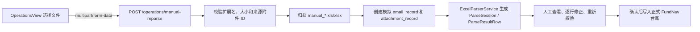
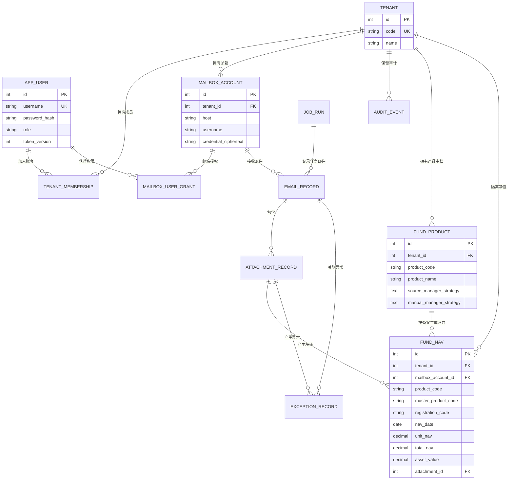
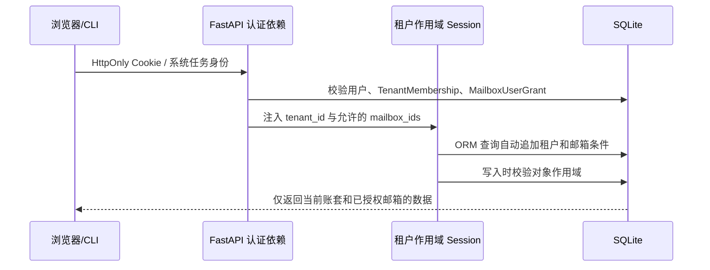

# 基金运营邮件自动解析与净值汇总系统

本项目用于自动读取基金净值邮件、归档并解析 Excel 附件、标准化净值数据、识别异常并生成每日汇总。

当前进度：

- 阶段 1（需求分析与架构设计）已完成，详见 [docs/stage-1-design.md](docs/stage-1-design.md)。
- 阶段 2（FastAPI 后端基础框架）已完成。
- 阶段 3（IMAP 邮件读取与附件归档）已完成。
- 阶段 4（Excel 智能识别与净值标准化）已完成。
- 阶段 5（SQLite 数据存储与幂等导入）已完成。
- 阶段 6（每日净值与异常 Excel 导出）已完成。
- 阶段 7（Vue 运营后台、登录认证与人工重解析）已完成。
- 多租户和多邮箱功能已开放：租户/成员、邮箱账户管理、四级邮箱授权、后端
  强制作用域、AES-GCM 凭据加密、追加式审计日志及邮箱级归档均已接通。
- 产品要素归纳已开放：托管附件中的 21 项表格字段按估值日留存，产品按备案代码归并，
  投资经理与投资策略支持人工覆盖、恢复附件来源及审计留痕。
- 报表中心已开放：支持内置竖版周报、租户 PPTX 模板、自定义报表区域、合同要素提取、
  字段级来源标识与人工覆盖审计，并使用邮箱净值生成收益指标和净值曲线。
- 字段中心已开放：系统字段通过受控 Provider 提供，租户可维护 `custom.*`
  自定义字段、产品字段值、生效日和来源说明，并按产品和报告日期测试统一解析结果。
- 批量报表已开放：支持多选基金、异步生成、进度轮询、单项失败重试、
  取消未开始项和 ZIP 打包下载；独立 Worker 默认使用 2 个并发通道。
- OnlyOffice 只读预览已接入：生成记录可直接打开 PPTX Web 预览，
  使用独立 JWT、短期文件 URL 和租户校验；Document Server 停机时仍可下载。
- 产品中心已整合产品台账与净值明细：支持卡片/表格视图、A/B/C 份额归纳、
  指定日期净值更新状态、待更新筛选和历史净值查询。
- 邮件同步与 Excel 解析已解耦：同步只归档并创建持久化解析任务，独立 Worker
  负责限流解析、失败重试和状态统计；人工上传先进入可编辑暂存区，经复核确认后入库。
- 资料中心阶段 2 已开放：公司资料与每个产品资料使用独立主体；旧备案文本和公司文件已分类迁移，
  历史产品材料进入管理员人工归属队列，迁移保持原文件路径、SHA-256 和版本不变。
- 旧备案资料接口保留查询、导出和下载能力并进入只读兼容模式；新增租户和后续解析出的产品
  会自动建立对应资料主体。
- 数据治理阶段 3 已开放：机构与材料模板、产品开户台账、公司及产品资料引用、提交版本冻结、
  退回补件、审批、确认开户和销户已形成完整流程；资料中心可直接上传文件并追加版本。

本轮前端重构、产品中心及备案资料库的实现记录见
[docs/development-2026-08-24.md](docs/development-2026-08-24.md)。

## 使用教程

项目同时提供 Linux 和 Windows 一键启动器。

### Linux 一键拉取部署

正式电脑首次克隆项目后，以及后续需要发布 GitHub 最新版本时，执行：

```bash
chmod +x 一键部署.sh scripts/deploy.sh
./一键部署.sh
```

脚本只接受远端分支的快进更新；发现正式目录存在代码修改或提交历史分叉时会停止，
不会覆盖现场文件。每次更新前自动备份 `data`、`.env` 和
`config/config.local.yaml`，随后安装变更的依赖、迁移数据库、运行检查、构建前端并重启服务。
部署成功后会显示公司内网访问地址。备份默认保存在项目下的 `backups/`，该目录不应提交。
默认部署会自动安装后端测试依赖；使用 `--skip-tests` 时只安装生产运行依赖。
Ubuntu/Debian 正式机缺少 Docker 时，脚本默认通过 `sudo` 安装 Docker Engine 和
Docker Compose v2、启用开机启动并启动 OnlyOffice；首次会要求系统管理员密码，完成后
应注销并重新登录一次。暂时不需要在线预览时可使用 `--skip-onlyoffice`。
OnlyOffice 镜像默认从 Docker Hub 拉取；公司网络无法访问 Docker Hub 时，镜像失败不会
阻断核心系统启动，可通过 `ONLYOFFICE_IMAGE=公司镜像地址 ./一键部署.sh` 使用内部镜像。
正式部署会将 OnlyOffice 的 8080 端口监听到内网网卡，并自动把浏览器访问地址设置为
`http://部署机内网IP:8080`，避免内网客户端错误访问自己的 `127.0.0.1`。使用 HTTPS
反向代理时，可通过 `FUND_NAV_ONLYOFFICE__PUBLIC_URL=https://文档服务域名` 覆盖该地址；
也可通过 `ONLYOFFICE_BIND_ADDRESS` 显式限制容器监听地址。

独立备份和恢复使用 `./scripts/backup.sh` 与 `./scripts/restore.sh`。恢复脚本会先校验完整的
SHA-256 清单，覆盖非空数据目录前必须显式使用 `--force`，并保留原目录作为回滚副本。
数据治理阶段 0 的基线、脱敏约束和恢复演练见 [docs/stage-0-baseline.md](docs/stage-0-baseline.md)。

数据治理阶段 1 已新增 `/api/v2` 统一主体、字段事实、不可变来源文件和显式权限底座；
权限、审计、迁移及验收范围见
[docs/data-governance-stage-1-acceptance.md](docs/data-governance-stage-1-acceptance.md)。

数据治理阶段 2 已完成公司与产品资料拆分、旧资料分类迁移、产品材料人工归属和旧接口只读适配；
迁移规则与验收范围见
[docs/data-governance-stage-2-acceptance.md](docs/data-governance-stage-2-acceptance.md)。

数据治理阶段 3 已完成机构管理、监管/机构材料模板、开户清单快照、提交版本冻结、补件及状态流转；
流程、权限和验收范围见
[docs/data-governance-stage-3-acceptance.md](docs/data-governance-stage-3-acceptance.md)。

测试耗时较长时，可在已经单独完成验收的发布版本上使用 `./一键部署.sh --skip-tests`。
首次部署仍需预先安装 Git、curl、Python 3.11/3.12、Node.js 22/24 LTS；
OnlyOffice 还需要 Docker Compose。生产环境建议在该脚本外层配置 Nginx/HTTPS，内网用户
只访问 443 端口。

Linux 脚本不会经过系统 Corepack：优先使用 `PATH` 中可正常运行的 pnpm 11；系统没有
pnpm 11 时，会通过 npm 在项目 `.tools/pnpm` 下安装固定版本，不需要 sudo，也不会修改
系统全局 Node.js 环境。

### Linux 一键启动（推荐）

在文件管理器中双击 `一键启动.desktop`，或在项目根目录执行：

```bash
./一键启动.sh
```

桌面启动器会按自身所在目录定位项目，不依赖固定的用户目录。若 5173 端口上运行的是本系统
其他项目副本遗留的前端，一键启动会识别并切换到当前目录；非本系统的 Web 服务不会被停止。

启动器会自动检查 Python 3.11/3.12、Node.js 22/24 LTS 和 pnpm 11，必要时在
项目内安装 Python 3.12 和 uv，然后安装依赖、生成业务密钥、执行数据库
迁移并启动前后端。首次启动会在终端中要求创建管理员，密码至少 10 位且
输入时不显示。启动成功后会打开 <http://127.0.0.1:5173>。

服务在后台运行，日志位于 `logs/backend.log`、`logs/frontend.log`、
`logs/report-worker.log` 和 `logs/parse-worker.log`。停止服务：

```bash
./一键启动.sh --stop
```

只初始化环境而不启动服务：

```bash
./一键启动.sh --setup-only
```

如果文件管理器首次打开 `.desktop` 文件时显示安全提示，选择“允许启动”即可。

### OnlyOffice Document Server

Linux 启动器会自动生成独立 OnlyOffice JWT 密钥，并在已安装 Docker
Compose 时启动 [compose.onlyoffice.yaml](compose.onlyoffice.yaml) 中固定的
`onlyoffice/documentserver:9.4.0.1`。本机首次安装 Docker 需要系统管理员密码：

```bash
sudo apt-get update
sudo apt-get install -y docker.io docker-compose-v2
sudo usermod -aG docker "$USER"
```

注销并重新登录 Linux 后，再执行 `./一键启动.sh`。OnlyOffice 的浏览器地址
默认为 <http://127.0.0.1:8080>，容器从 `host.docker.internal:8000` 读取经签名的
报表文件。生产部署应将 `public_url` 和 `callback_base_url` 换成可相互访问的 HTTPS 地址。

### Windows 一键启动（推荐）

直接双击项目根目录的 `一键启动.cmd`。启动器会按需完成：

1. 检测 Python 3.11/3.12；缺失时通过 `winget` 安装 Python 3.12。
2. 创建 `.venv`，并在 `backend/pyproject.toml` 变化时自动更新后端依赖。
3. 检测 Node.js 22/24 和 pnpm 11；缺失时通过 `winget`/`npm` 安装。
4. 根据 `package.json` 和 `pnpm-lock.yaml` 变化自动更新前端依赖。
5. 首次创建 `.env`，补齐邮箱凭据加密与审计签名密钥，不显示或覆盖已有密钥。
6. 自动执行 Alembic 数据库迁移；没有平台管理员时，提示创建 `admin` 并输入密码。
7. 分别打开后端和前端服务窗口，等待就绪后打开 <http://127.0.0.1:5173>。

重复双击不会重置数据库、管理员、密钥或邮箱配置。停止系统时，在两个服务窗口中按
`Ctrl+C` 或关闭窗口。若不希望自动打开浏览器，可在 PowerShell 中执行：

```powershell
powershell.exe -ExecutionPolicy Bypass -File .\scripts\start.ps1 -NoBrowser
```

若只想安装依赖、初始化安全密钥并执行数据库迁移，不创建管理员或启动服务，可执行：

```powershell
powershell.exe -ExecutionPolicy Bypass -File .\scripts\start.ps1 -SetupOnly
```

首次安装 Python、Node.js 或依赖需要联网，`winget` 可能显示 Windows 权限确认。若电脑
没有 `winget`，请先手工安装 Python 3.12 和 Node.js 24 LTS，再重新双击启动器。

### 1. 配置邮箱

编辑 `config/config.yaml` 中的邮箱连接信息：

```yaml
email:
  host: imap.example.com
  port: 993
  username: operations@example.com
  auth_mode: password
  use_ssl: true
  start_tls: false
```

旧版单邮箱可继续在项目根目录 `.env` 中填写授权码作为默认邮箱的一次性引导。多邮箱
模式更推荐先创建管理员，再到“邮箱账户”页面逐个录入新授权码：

```dotenv
FUND_NAV_EMAIL__PASSWORD=你的邮箱授权码
```

首次启用时必须生成两个相互独立的 32 字节密钥。推荐执行以下命令：它只补齐 `.env`
中缺失的密钥，不覆盖已有值，也不会在终端打印密钥内容：

```powershell
.\.venv\Scripts\python.exe -m app.cli.init_security_keys
```

执行后应重启后端。不要截图或复制 `.env` 中生成的值。

`CREDENTIAL_ENCRYPTION_KEY` 用于 AES-256-GCM 邮箱凭据加密，
`AUDIT_SIGNING_KEY` 用于审计日志 HMAC 哈希链。两者不得相同，也不得在已有密文后
随意更换，否则旧邮箱授权码将无法解密、旧审计链将无法验证。开发环境未配置时后端
可以以只读方式启动，但新增/编辑邮箱、连接检测、邮件同步和人工重解析会被安全门禁
拒绝；生产环境缺少任一专用密钥时会直接拒绝启动。

不要使用曾经发到聊天、工单或截图中的密钥和邮箱授权码。发生暴露时，应先在邮箱侧
撤销授权码，再生成新的邮箱授权码和两把未展示过的本地业务密钥。

Outlook / Microsoft 365 使用 OAuth2 时，参见下文“邮箱配置与人工同步”。

### 2. 初始化数据库和管理员

进入项目根目录：

```powershell
Set-Location "C:\Users\yyh01\Documents\Email"
```

执行数据库迁移：

```powershell
.\.venv\Scripts\python.exe -m alembic -c backend\alembic.ini upgrade head
```

该迁移会把现有单账套数据回填到“默认业务账套”和“默认邮箱”，为已有用户建立成员关系
和邮箱授权，并把所有邮件、附件、净值、异常和任务记录补齐租户作用域。首次启动后，
应用会把当前有效的邮箱授权码加密写入 `mailbox_account.credential_ciphertext`。确认页面
连接检测成功后，可以清空 YAML 中的 `email.password`；本地 `.env` 可仅在首次迁移期间
保留旧 `FUND_NAV_EMAIL__PASSWORD`。两个业务安全密钥必须长期保留。

创建管理员账号。系统没有默认账号或默认密码，密码由你在终端中输入两次：

```powershell
.\.venv\Scripts\python.exe -m app.cli.create_admin --username admin
```

管理员已经创建过时，不需要重复执行该命令。

### 3. 启动系统

打开第一个 PowerShell 窗口，启动后端：

```powershell
Set-Location "C:\Users\yyh01\Documents\Email"
.\.venv\Scripts\python.exe -m uvicorn app.main:app --app-dir backend --reload
```

打开第二个 PowerShell 窗口，启动前端：

```powershell
Set-Location "C:\Users\yyh01\Documents\Email\frontend"
pnpm.cmd dev
```

浏览器访问 <http://127.0.0.1:5173>，使用刚创建的管理员账号登录。后端 API 文档位于 <http://127.0.0.1:8000/docs>。

首次创建的管理员是“平台管理员”。登录后建议先进入“系统管理 → 租户与成员”：

1. 新建真实业务租户，例如租户代码 `jiyu`、名称“吉余私募”；租户代码创建后不可修改。
2. 再新建 `qianguo`、名称“千果私募”。平台管理员会自动成为新租户的租户管理员。
3. 点击“成员”，为每个租户添加租户管理员、运营人员或只读用户。新用户名需要设置至少
   10 位初始密码；平台管理员可把系统内已有用户名直接加入另一个租户，此时密码留空。
   普通租户管理员不能关联其他租户已有身份，避免利用用户名探测或擅自建立跨租户关系。
4. 使用页面顶部“当前租户”切换到目标租户，再到“邮箱账户”配置该租户自己的邮箱。
5. 成员加入租户不会自动获得邮箱正文、同步或凭据权限，仍需在“邮箱账户 → 权限”单独授权。

只属于一个租户的用户登录后直接进入该租户；属于多个租户的用户验证账号密码后，必须
在登录页选择本次业务租户。进入系统后也可以从顶部切换，切换时后端会重新验证成员关系、
签发绑定目标租户的新 Cookie，并重新加载页面，避免上一租户的页面缓存残留。

登录后先进入“邮箱账户”。管理员可新增多个 IMAP 邮箱，或编辑初始化生成的“默认邮箱”；
授权码/OAuth2 令牌只在保存时提交一次，页面和 API 永远不会回显明文或密文。每个邮箱
可独立设置服务器、端口、账号、目录、回看天数、默认状态和启停状态。保存后先点击
“检测”，成功后再点“同步”。连接检测只执行 IMAP 建连、认证和只读目录选择，不读取
邮件正文，也不会改变邮件已读状态。

管理员在“邮箱账户 → 权限”中按用户授予以下权限：

- 元数据：查看邮箱账号和该邮箱产生的业务记录；
- 邮件正文：预览正文、附件清单和下载原始 EML；
- 连接/同步：测试连接、同步邮件、处置异常和人工重新解析；
- 凭据管理：新增或更换授权码，仅允许租户管理员持有。

“邮件管理”“基金净值”“异常管理”和“人工处理”都支持选择来源邮箱。后端会再次校验
登录会话中的租户和邮箱授权，不能通过修改 URL 或请求参数访问未授权邮箱。

停止系统时，在两个 PowerShell 窗口中分别按 `Ctrl+C`。

### 4. 处理一批基金净值邮件

需要立即读取一次邮箱时，在项目根目录执行：

```powershell
.\.venv\Scripts\python.exe -m app.cli.mail_sync
```

省略 `--mailbox-id` 时同步默认邮箱；同步指定邮箱时使用“邮箱账户”页面显示的 ID：

```powershell
.\.venv\Scripts\python.exe -m app.cli.mail_sync --mailbox-id 2
```

邮件同步只完成候选邮件和附件归档。Excel 解析由独立 Worker 消费数据库队列；
一键启动器会自动启动它，手工部署时需另开一个终端运行：

```powershell
.\.venv\Scripts\python.exe -m app.cli.attachment_parse_worker
```

使用 `--once` 可在当前队列清空后退出，适合定时任务或部署验收。

同步完成后的推荐操作顺序：

1. 在“运营概览”确认今日邮件数、解析成功数和待处理异常。
2. 在“邮箱账户”选择目标邮箱检测连接并同步；再到“邮件管理”按来源邮箱查看处理状态。
3. 在“基金净值”按产品或日期查询数据，并检查历史净值曲线。
4. 在“产品要素”查看按备案代码归并的产品主体、A/B/C/总份额和最新 21 项托管字段；
   经理、策略缺失或需要修订时可进入详情人工编辑，表格字段不可人工改写。
5. 在“异常管理”复核缺字段、空净值、重复数据和格式错误；点击异常右侧“查看”可核对其原始邮件。
6. 附件解析失败时，在“解析与人工复核”查看任务状态或重试；人工上传的 Excel
   会先生成逐行暂存结果，可修正、忽略、处理重复冲突并重新校验，确认后才写入正式台账。
7. 在“基金净值”页面选择业务日期并导出每日汇总 Excel。

也可以通过命令行导出指定日期：

```powershell
.\.venv\Scripts\python.exe -m app.cli.export_daily --date 2026-07-24
```

### 5. 数据文件位置

系统不会覆盖原始邮件和历史净值。运行数据默认位于：

```text
data/
├── fund_nav.db                    # SQLite 数据库
└── tenants/{tenant_id}/
    ├── mailboxes/{mailbox_account_id}/YYYY/MM/DD/
    │   ├── emails/            # 原始邮件
    │   ├── attachments/       # 原始及人工上传附件
    │   └── exports/           # 每日基金净值汇总.xlsx
    └── reporting/
        ├── contracts/             # 产品合同原文
        ├── templates/             # 租户自定义 PPTX 模板
        └── exports/YYYY/MM/        # 生成的 PPTX 报表
```

### 6. 常见问题

- PowerShell 提示 `pnpm.ps1 cannot be loaded`：使用 `pnpm.cmd dev`，不需要降低 PowerShell 安全策略。
- 登录提示用户名或密码错误：确认已经执行管理员创建命令；系统不存在默认密码。
- 邮箱认证失败：优先检查 IMAP 是否已启用、授权码是否正确，以及 `use_ssl` 与 `start_tls` 是否配置冲突。
- 163 邮箱：使用 `imap.163.com:993`、SSL 和客户端授权码。系统在服务器声明支持 RFC 2971 `ID` 时，会在登录后发送不含账号和密钥的客户端标识，兼容163的 `Unsafe Login` 校验。
- QQ 邮箱连接提示“账号或授权码验证失败”：在 QQ 邮箱设置中启用 IMAP 服务并重新生成授权码，将新授权码写入 `.env` 的 `FUND_NAV_EMAIL__PASSWORD`，然后重启后端。
- 页面打不开：确认后端 `8000` 端口和前端 `5173` 端口的两个进程都仍在运行。
- Excel 没有入库：前往“异常管理”查看缺失字段或格式识别信息，不要直接修改数据库。

## 后端本地运行

要求 Python 3.11 或 3.12。

```powershell
python -m venv .venv
.\.venv\Scripts\python.exe -m pip install -e ".\backend[dev]"
if (!(Test-Path ".env")) { Copy-Item ".env.example" ".env" }
.\.venv\Scripts\python.exe -m alembic -c backend\alembic.ini upgrade head
.\.venv\Scripts\python.exe -m app.cli.create_admin --username admin
.\.venv\Scripts\python.exe -m uvicorn app.main:app --app-dir backend --reload
```

服务启动后可访问：

- API 文档：<http://127.0.0.1:8000/docs>
- 存活检查：<http://127.0.0.1:8000/api/v1/health/live>
- 就绪检查：<http://127.0.0.1:8000/api/v1/health/ready>

运行测试：

```powershell
.\.venv\Scripts\python.exe -m pytest backend/tests
```

配置默认从 `config/config.yaml` 读取。生产环境中的密码等敏感值应通过环境变量注入，环境变量前缀为 `FUND_NAV_`，嵌套字段使用双下划线，例如 `FUND_NAV_EMAIL__PASSWORD`。管理员创建命令会交互式读取密码，不会把密码写入命令历史。

## 前端本地运行

要求 Node.js 22 或 24、pnpm 11。先启动后端，再在另一个 PowerShell 窗口执行：

```powershell
Set-Location frontend
pnpm.cmd install
pnpm.cmd dev
```

浏览器访问 <http://127.0.0.1:5173>。Vite 会把 `/api` 请求代理到本机 `8000` 端口；登录状态保存在服务端签名的 HttpOnly Cookie 中，前端不会把账号或令牌写入浏览器本地存储。

生产构建与前端测试：

```powershell
Set-Location frontend
pnpm.cmd type-check
pnpm.cmd test
pnpm.cmd build
```

## 邮箱配置与人工同步

通用 IMAP、QQ 企业邮箱等使用授权码时：

```yaml
email:
  host: imap.example.com
  port: 993
  username: operations@example.com
  auth_mode: password
  password: ""
  use_ssl: true
  start_tls: false
```

Outlook / Microsoft 365 若租户要求现代认证，可将 `auth_mode` 改为 `oauth2`，并通过 `FUND_NAV_EMAIL__OAUTH2_ACCESS_TOKEN` 注入访问令牌。访问令牌的申请和刷新由企业身份平台负责，本系统不会把令牌写入归档或日志。

执行一次邮箱同步：

```powershell
.\.venv\Scripts\python.exe -m app.cli.mail_sync
```

同步过程不会修改邮件已读状态。系统先读取主题、附件结构和邮件大小做轻量初筛，只有候选
邮件才下载完整正文；不兼容元数据预取的 IMAP 服务会自动回退到完整邮件。候选邮件归档到
`data/tenants/{tenant_id}/mailboxes/{mailbox_account_id}/YYYY/MM/DD` 后，只创建持久化解析
任务。独立 Worker 随后验证附件 SHA-256、调用解析器，并把相同租户/邮箱作用域的净值与
异常写入数据库。超过资源上限的邮件登记为 `rejected`，避免每轮同步重复下载“毒邮件”。

## Excel 格式兼容

解析器不依赖附件名称判断业务类型，而是扫描每个工作表前部的 1～3 行候选表头，根据字段命中情况和托管特征字段评分。当前支持：

- 单基金每日净值表
- 多基金汇总净值表
- 基金资产净值浏览表
- `.xlsx` 和历史 `.xls`
- 标题行、空行、多行表头、跨行拆分字段
- 全半角、换行、括号和“元”等单位差异
- 日期字符串、Excel日期序号和日期单元格
- 千分位、货币符号、括号负数和高精度Decimal
- 多工作表分别识别
- 缺字段、格式歧义、日期错误、数值错误、净值为空和文件内重复记录

不同托管平台的字段名称通过 [config/excel_fields.yaml](config/excel_fields.yaml) 维护。新增托管格式时，应添加经过确认的精确别名；无法唯一识别的格式会进入异常记录，不会猜测入库。

## 数据库与幂等规则

SQLite 默认文件为 `data/fund_nav.db`，当前迁移版本为 `20260807_0007`。核心表包括：

- `tenant` / `tenant_membership`：业务账套及用户在账套内的角色
- `mailbox_account`：邮箱非敏感配置、AES-GCM 凭据密文和最近连接/同步状态
- `mailbox_user_grant`：邮箱元数据、正文、操作和凭据管理四级授权
- `fund_nav`：标准化净值，数据库唯一键为 `tenant_id + product_code + nav_date`
- `email_record`：邮箱、UIDVALIDITY、UID、主题、发送人与处理状态
- `attachment_record`：附件原名、归档路径、SHA-256 与解析状态
- `exception_record`：格式、字段、重复、文件完整性等运营异常
- `job_run`：定时任务与人工任务的执行审计
- `app_user`：全局登录身份、平台管理员标记和会话失效版本；业务角色来自成员关系
- `audit_event`：只追加、脱敏并由 HMAC 哈希链保护的合规操作记录
- `product_document`：合同原文、文件哈希、提取状态及字段结果
- `report_template`：内置/上传 PPTX 模板的租户级索引
- `report_definition`：用户保存的产品、区域、日期和模板组合
- `report_run`：每次报表生成的输入快照、输出路径、状态和错误

净值写入仅提供新增语义，不提供覆盖接口。基金代码入库前会去除首尾空格并统一转成大写；同一产品代码和日期再次导入时，系统保留首次记录，并新增 `duplicate_nav` 异常。每个附件的净值、异常与状态在同一事务中提交，任一步骤失败会整体回滚。

迁移检查：

```powershell
.\.venv\Scripts\python.exe -m alembic -c backend\alembic.ini current
.\.venv\Scripts\python.exe -m alembic -c backend\alembic.ini check
```

阶段 5 的详细设计与验证见 [docs/stage-5-storage.md](docs/stage-5-storage.md)。

## 每日 Excel 汇总导出

导出指定业务日期：

```powershell
.\.venv\Scripts\python.exe -m app.cli.export_daily --date 2026-07-24
```

省略 `--date` 时，系统使用 `storage.archive_timezone` 配置的本地日期。报表保存到：

```text
data/tenants/{tenant_id}/mailboxes/{mailbox_account_id}/YYYY/MM/DD/exports/每日基金净值汇总.xlsx
```

Web“基金净值”页面的导出日期规则与 CLI 略有不同，更适合托管邮件延迟到达的运营场景：

1. 已选择估值日期区间：使用区间结束日期（只有一个日期时使用该日期）。
2. 未选择估值日期：通过 `GET /api/v1/fund-nav/latest-date` 查询数据库中最大的 `fund_nav.nav_date`。
3. 数据库没有任何净值：禁用导出按钮并显示“暂无可导出净值”，不会回退到电脑当天日期生成空报表。

例如邮件在 `2026-08-03` 收到，但附件估值日为 `2026-07-31`，未选择日期时页面默认导出 `2026-07-31`。

工作簿包含：

- `基金净值`：日期、产品代码、产品名称、单位净值、累计净值、资产净值和来源
- `异常记录`：日期缺失、产品重复、净值为空、格式错误、文件异常等审计明细

同一天重新导出时使用临时文件和原子替换。只有新文件完整保存后才会替换旧报表；构建失败时旧文件保持不变。导出文件名可通过 `storage.daily_export_filename` 配置，详细说明见 [docs/stage-6-export.md](docs/stage-6-export.md)。

## Web 运营后台

阶段 7 提供以下页面：

- 运营概览：今日邮件、解析成功、基金数量、待处理异常与最新净值批次
- 租户与成员：平台管理员创建/停用租户，租户管理员维护本租户成员及角色
- 邮箱账户：新增、编辑、停用多组 IMAP 邮箱，逐邮箱检测/同步并管理用户授权；凭据不回显
- 邮件管理：按关键词、收件日期和状态查询邮件审计记录，并安全预览原邮件或下载 `.eml` 归档
- 基金净值：按产品与日期查询、导出日报、查看单产品历史净值曲线；产品筛选以下拉框展示数据库中已有历史净值的全部基金，同一基金的普通份额及 A/B/C 类份额归入同一分组并相邻排列
- 产品要素：按备案代码归并产品主体，统计最新份额和资产规模，查看 21 项托管字段；
- 报表中心：选择内置或租户 PPTX 模板，自定义报表区域，上传合同提取产品要素，预览
  收益指标和净值曲线，并下载带输入快照的基金周报；
  表格字段只读，投资经理和投资策略允许运营人员或管理员编辑并恢复附件来源
- 异常管理：分类筛选、查看异常关联的原始邮件，并由运营人员完成解决、忽略或重新打开
- 人工处理：上传失败的 `.xls` / `.xlsx` 重新解析，文件与操作记录独立归档

租户角色分为 `admin`、`operator` 和 `viewer`，角色决定功能上限，邮箱授权决定实际资源范围。
`is_platform_admin` 是独立的平台级能力，只允许创建、编辑和停用租户，不替代用户在各租户
中的成员关系。平台管理员创建租户时，系统会自动为其建立该租户的 `admin` 成员关系。
即使用户是运营角色，也必须获得目标邮箱的“连接/同步”权限后才能同步、处置异常或
人工重解析。前端采用业务模块注册机制，基金运营只是当前第一个模块；后续可通过独立
模块接入对账、份额登记、指令管理等运营能力。详细说明见
[docs/stage-7-web.md](docs/stage-7-web.md)。

---

## 项目代码结构与模块说明

> 已确认但尚未修复的缺陷及临时风险控制见 [docs/known-issues.md](docs/known-issues.md)。

本节是当前仓库的代码交接地图，描述的是已经存在的代码，而不是规划中的功能。`.venv/`、`frontend/node_modules/`、`frontend/dist/`、`data/`、`logs/` 等运行生成目录不属于业务源代码，因此不在源代码树中展开。

### 当前实现边界

| 能力 | 当前状态 | 入口 |
| --- | --- | --- |
| IMAP 邮箱连接、连接检测 | 已实现 | `email/imap_client.py`、`services/email_connection_service.py` |
| 手工立即同步邮箱 | 已实现 | `POST /api/v1/emails/sync`、`cli/mail_sync.py` |
| MIME 邮件及附件提取 | 已实现 | `email/mime_parser.py` |
| EML、附件、清单归档 | 已实现 | `services/archive_service.py` |
| XLS/XLSX 智能识别与标准化 | 已实现 | `parsers/` |
| 产品要素快照、产品主档及说明维护 | 已实现 21 项表格字段、份额归并和人工说明留痕 | `db/models/fund_product.py`、`api/v1/fund_products.py`、`FundProductsView.vue` |
| 合同要素与报表制作 | 已实现合同提取、字段来源/人工覆盖审计、内置和上传 PPTX 模板、自定义区域及净值曲线 | `services/reporting_service.py`、`services/report_presentation_service.py`、`api/v1/reports.py`、`ReportCenterView.vue` |
| SQLite 持久化及幂等控制 | 已实现 | `db/`、`repositories/`、`services/persistence_service.py` |
| 日报 Excel 导出 | 已实现 | `services/export_service.py`、`exports/` |
| Web 登录及运营后台 | 已实现 | `api/`、`frontend/src/` |
| 租户、成员和邮箱资源授权 | 已开放，支持登录选择、顶部切换、多邮箱和四级用户授权 | `api/v1/tenants.py`、`TenantManagementView.vue`、`api/v1/mailboxes.py` |
| 邮箱凭据加密 | 已实现 AES-256-GCM，密文绑定租户和邮箱 ID | `core/credential_security.py` |
| 合规审计日志 | 已实现追加写、脱敏和 HMAC 哈希链 | `services/audit_service.py`、`GET /api/v1/audit-events` |
| 异常邮件正文查看及 EML 下载 | 已实现 | `services/email_detail_service.py`、`EmailDetailDialog.vue` |
| 人工上传重新解析 | 已实现 | `services/manual_reparse_service.py` |
| APScheduler 自动定时执行 | **尚未接入运行器**；当前只有 `scheduler` 配置模型 | 后续阶段 |
| Docker Compose 部署 | **尚未实现**；仓库当前没有 Dockerfile 或 `docker-compose.yml` | 后续阶段 |

### 总体架构


系统按分层方式组织：

- `email` 只负责 IMAP、MIME 和同步过程中的轻量对象，不理解基金净值业务。
- `parsers` 只负责读取 Excel、识别表格和生成标准记录，不直接写数据库。
- `services` 编排跨模块业务流程和事务。
- `repositories` 封装可复用的数据查询及插入规则。
- `db/models` 定义数据库实体、唯一约束和关联关系。
- `api` 把服务暴露为 HTTP 接口，并执行登录、权限与参数校验。
- `frontend` 调用 HTTP 接口，不直接访问 SQLite 或归档目录。

### 完整目录树

```text
Email/
├── README.md                              # 项目总说明、使用教程、代码地图和数据流
├── .env.example                           # 敏感环境变量示例；真实 .env 不提交
├── .gitignore                             # 忽略密钥、数据库、日志、依赖和构建产物
├── config/
│   ├── config.yaml                        # 当前本机非敏感运行配置
│   ├── config.example.yaml                # 可复制的生产配置模板
│   └── excel_fields.yaml                  # Excel 标准字段别名和三类工作簿识别规则
├── docs/
│   ├── known-issues.md                    # 已确认缺陷、风险控制和验收标准
│   ├── stage-1-design.md                  # 阶段1架构与数据库设计
│   ├── stage-5-storage.md                 # 阶段5持久化、事务和幂等说明
│   ├── stage-6-export.md                  # 阶段6日报导出说明
│   └── stage-7-web.md                     # 阶段7前端、权限和模块扩展说明
├── data/                                  # 运行数据；不提交业务文件
│   ├── fund_nav.db                        # SQLite 数据库
│   ├── .email_uid_state/                  # IMAP UID 处理中/已完成幂等标记
│   └── tenants/{tenant_id}/
│       ├── mailboxes/{mailbox_account_id}/YYYY/MM/DD/
│       │   ├── emails/                # 原始 .eml 和邮件 JSON 审计清单
│       │   ├── attachments/           # 原始附件与人工上传附件
│       │   └── exports/               # 每日基金净值汇总.xlsx
│       └── reporting/
│           ├── contracts/                 # 合同原文与提取来源
│           ├── templates/                 # 租户自定义 PPTX 模板
│           └── exports/YYYY/MM/            # 报表运行输出
├── logs/
│   └── backend.log                        # JSON 格式、按大小滚动的后端日志
├── backend/
│   ├── pyproject.toml                     # Python 依赖、pytest 和 Ruff 配置
│   ├── alembic.ini                        # Alembic 数据库迁移入口配置
│   ├── README.md                          # 后端简要说明
│   ├── alembic/
│   │   ├── env.py                         # 把 SQLAlchemy metadata 和运行配置交给 Alembic
│   │   ├── script.py.mako                 # 新迁移脚本模板
│   │   └── versions/
│   │       ├── 20260728_0001_initial_schema.py  # 建立核心业务表、索引和约束
│   │       ├── 20260729_0002_user_roles.py      # 增加用户角色及令牌版本
│   │       ├── 20260804_0003_tenant_mailbox_audit.py # 租户、邮箱、作用域和审计
│   │       ├── 20260805_0004_multi_mailbox.py # 多邮箱配置来源、运行状态和单默认约束
│   │       ├── 20260805_0005_tenant_management.py # 平台管理员标记和租户管理开放
│   │       ├── 20260805_0006_product_elements.py # 产品主档和每日托管要素快照
│   │       └── 20260807_0007_reporting_center.py # 合同要素、报表模板/任务及人工覆盖
│   ├── app/
│   │   ├── __init__.py                    # 后端包版本
│   │   ├── main.py                        # FastAPI 应用工厂、生命周期、中间件和总路由
│   │   ├── api/
│   │   │   ├── __init__.py                # API 包标记
│   │   │   ├── deps.py                    # 当前租户、邮箱授权、作用域会话和角色依赖
│   │   │   ├── schemas/
│   │   │   │   ├── __init__.py            # Schema 包标记
│   │   │   │   ├── auth.py                # 登录、用户和会话响应结构
│   │   │   │   ├── common.py              # 通用分页响应结构
│   │   │   │   ├── email_connection.py    # 邮箱配置、连接检测和同步统计响应
│   │   │   │   ├── email_detail.py        # 邮件正文和附件详情响应
│   │   │   │   ├── operations.py          # 概览、邮件、净值、异常、重解析响应
│   │   │   │   ├── fund_product.py        # 产品统计、快照详情和说明编辑结构
│   │   │   │   ├── audit.py               # 审计事件响应结构
│   │   │   │   ├── mailbox.py             # 多邮箱配置、安全状态、成员和授权结构
│   │   │   │   ├── tenant.py              # 租户创建、编辑和成员关系结构
│   │   │   │   └── reporting.py           # 合同、字段来源、模板、预览与生成结构
│   │   │   └── v1/
│   │   │       ├── __init__.py            # v1 路由包标记
│   │   │       ├── router.py              # 汇总所有 `/api/v1` 子路由
│   │   │       ├── auth.py                # 登录、租户选择/切换、退出和当前用户
│   │   │       ├── tenants.py             # 平台租户和租户成员管理
│   │   │       ├── health.py              # 存活和数据库就绪检查
│   │   │       ├── dashboard.py           # 运营概览指标
│   │   │       ├── emails.py              # 按授权邮箱检测、同步、列表、正文和 EML 下载
│   │   │       ├── mailboxes.py           # 多邮箱 CRUD、逐邮箱操作和用户授权
│   │   │       ├── fund_nav.py            # 净值查询、产品搜索、历史曲线和日报下载
│   │   │       ├── fund_products.py       # 产品要素统计、详情和经理/策略维护
│   │   │       ├── exceptions.py          # 异常筛选及解决/忽略状态更新
│   │   │       ├── operations.py          # 人工上传 Excel 重新解析
│   │   │       ├── audit.py               # 管理员租户内审计日志查询
│   │   │       └── reports.py             # 合同、要素、模板、预览、生成与下载 API
│   │   ├── cli/
│   │   │   ├── __init__.py                # CLI 包标记
│   │   │   ├── create_admin.py            # 创建或更新管理员账号
│   │   │   ├── init_security_keys.py       # 不回显地初始化两把独立业务密钥
│   │   │   ├── mail_sync.py               # 命令行触发一次邮箱同步
│   │   │   └── export_daily.py            # 命令行导出指定业务日期日报
│   │   ├── core/
│   │   │   ├── __init__.py                # 核心基础设施包标记
│   │   │   ├── config.py                  # YAML、.env、环境变量加载及配置校验
│   │   │   ├── context.py                 # 请求上下文变量
│   │   │   ├── errors.py                  # 统一业务错误与 HTTP 错误响应
│   │   │   ├── files.py                   # 原子文件写入
│   │   │   ├── logging.py                 # JSON 日志和滚动文件配置
│   │   │   ├── middleware.py              # 请求 ID、耗时和访问日志中间件
│   │   │   ├── security.py                # PBKDF2 密码散列和签名会话令牌
│   │   │   └── credential_security.py     # AES-GCM 凭据加密和审计密钥派生
│   │   ├── db/
│   │   │   ├── __init__.py                # 数据库包标记
│   │   │   ├── base.py                    # SQLAlchemy Declarative Base 与命名规则
│   │   │   ├── session.py                 # Engine、默认拒绝及租户/邮箱自动过滤
│   │   │   ├── types.py                   # UTC 时间数据库类型
│   │   │   └── models/
│   │   │       ├── __init__.py            # 集中导出全部 ORM 模型和枚举
│   │   │       ├── app_user.py            # 后台用户
│   │   │       ├── email_record.py        # 邮件记录和附件记录
│   │   │       ├── fund_nav.py            # 标准基金净值
│   │   │       ├── fund_product.py        # 备案主体主档和可编辑说明双层值
│   │   │       ├── exception_record.py    # 文件、字段、重复等异常
│   │   │       ├── job_run.py             # 同步、导出、人工任务审计
│   │   │       ├── enums.py               # 邮件、附件、异常、任务、角色状态枚举
│   │   │       ├── tenant.py              # 租户、成员关系和邮箱用户授权
│   │   │       ├── mailbox_account.py     # 独立邮箱连接配置和凭据密文
│   │   │       ├── audit_event.py         # 追加式合规审计事件
│   │   │       ├── mixins.py              # 时间、租户及邮箱作用域公共列
│   │   │       └── reporting.py           # 合同文档、报表模板、定义和运行记录
│   │   ├── domain/
│   │   │   ├── __init__.py                # 领域规则包标记
│   │   │   ├── fund_identity.py           # 份额类别排序和备案主体归并规则
│   │   │   └── exception_categories.py    # 底层异常代码到中文运营类别的映射
│   │   ├── email/
│   │   │   ├── __init__.py                # 邮件接入包标记
│   │   │   ├── imap_client.py             # 只读 IMAP 连接、UID 搜索和完整邮件获取
│   │   │   ├── mime_parser.py             # 解析主题、发件人、Message-ID 和 MIME 附件
│   │   │   ├── models.py                  # 邮件同步过程的数据传输对象
│   │   │   └── uid_registry.py            # 文件级 UID 预留与完成标记，防止重复处理
│   │   ├── parsers/
│   │   │   ├── __init__.py                # Excel 解析包标记
│   │   │   ├── workbook_reader.py         # 根据真实文件签名选择 openpyxl 或 xlrd
│   │   │   ├── field_registry.py          # 加载字段别名、标准化表头并匹配字段
│   │   │   ├── detector.py                # 扫描多行表头并对三类工作簿评分
│   │   │   ├── normalizers.py             # 空值、文本、代码、日期、Decimal 标准化
│   │   │   ├── models.py                  # 检测结果、标准记录、解析问题等领域对象
│   │   │   ├── base.py                    # 通用行遍历、元数据回退、字段转换和校验
│   │   │   ├── single_fund.py             # 单基金每日净值表适配器
│   │   │   ├── fund_summary.py            # 多基金净值汇总表适配器
│   │   │   ├── asset_browser.py           # 基金资产净值浏览表适配器
│   │   │   └── service.py                 # 多 Sheet 解析总入口、歧义及重复行检查
│   │   ├── repositories/
│   │   │   ├── __init__.py                # 集中导出仓储对象
│   │   │   ├── email_repository.py        # 按邮箱 UID 业务键查询邮件
│   │   │   ├── fund_nav_repository.py     # 只插入净值及并发唯一冲突处理
│   │   │   ├── exception_repository.py    # 新增异常记录
│   │   │   ├── export_repository.py       # 日报净值和异常只读查询
│   │   │   └── user_repository.py         # 用户查询
│   │   ├── services/
│   │   │   ├── __init__.py                # 业务服务包标记
│   │   │   ├── email_connection_service.py    # 独立测试邮箱连接并返回脱敏结果
│   │   │   ├── email_service.py               # IMAP 搜索、UID 预留、候选筛选、归档编排
│   │   │   ├── mail_sync_runner.py            # 同步互斥锁、job_run 及完整依赖装配
│   │   │   ├── archive_service.py             # EML、附件、清单安全归档和文件名清理
│   │   │   ├── attachment_processing_service.py # 哈希复核、调用解析器和持久化
│   │   │   ├── persistence_service.py         # 邮件、附件、净值、异常事务写入及状态汇总
│   │   │   ├── email_detail_service.py        # 安全读取原始邮件并将 HTML 转成纯文本
│   │   │   ├── manual_reparse_service.py      # 人工附件归档、审计并复用统一解析链
│   │   │   ├── export_service.py              # 查询日报数据、构建工作簿、原子发布
│   │   │   ├── auth_service.py                # 用户认证和账号创建
│   │   │   ├── foundation_service.py          # 单邮箱到默认租户/邮箱的兼容引导
│   │   │   ├── mailbox_account_service.py     # 多邮箱配置、授权、凭据加解密和运行配置
│   │   │   ├── audit_service.py               # 审计脱敏、追加写和 HMAC 链校验
│   │   │   ├── reporting_service.py           # 合同提取、要素溯源、指标和生成快照
│   │   │   └── report_presentation_service.py # 内置/上传 PPTX 渲染和净值曲线重建
│   │   └── exports/
│   │       ├── __init__.py                # 集中导出日报构建对象
│   │       ├── models.py                  # 日报净值行和异常行传输对象
│   │       └── daily_workbook.py          # 两个 Sheet 的格式、公式防护和条件样式
│   └── tests/
│       ├── conftest.py                    # 每项测试隔离 SQLite、配置和密钥
│       ├── integration/
│       │   ├── __init__.py                # 集成测试包标记
│       │   ├── test_admin_api.py          # 登录、权限及主要运营 API 集成测试
│       │   ├── test_export_service.py     # 日报文件和任务状态集成测试
│       │   ├── test_health.py             # 健康检查与统一错误结构
│       │   ├── test_manual_reparse.py     # 人工重解析全链路测试
│       │   ├── test_migrations.py         # Alembic 升级、检查和降级测试
│       │   ├── test_tenant_isolation_api.py # 两个租户的 API 数据隔离
│       │   ├── test_multi_mailbox_api.py # 多邮箱创建、密文、授权和越权拦截
│       │   └── test_tenant_management_api.py # 租户创建、登录选择、切换和成员权限
│       └── unit/
│           ├── __init__.py                # 单元测试包标记
│           ├── test_archive_service.py    # 归档目录、附件和大小限制
│           ├── test_config.py             # 配置优先级与安全校验
│           ├── test_daily_workbook.py     # 导出 Sheet、格式和公式防注入
│           ├── test_detector.py           # 多行表头、类型评分和歧义
│           ├── test_email_connection_service.py # 邮箱连接检测
│           ├── test_email_detail_service.py     # 正文解析、HTML 安全和路径保护
│           ├── test_email_service.py      # 邮箱同步、筛选、重试和单邮件隔离
│           ├── test_excel_parser_service.py     # 三类 Excel 解析与异常
│           ├── test_field_registry.py     # 托管字段别名扩展
│           ├── test_imap_client.py        # IMAP 返回值和错误映射
│           ├── test_init_security_keys.py # 安全密钥初始化不覆盖测试
│           ├── test_mime_parser.py        # MIME 附件提取
│           ├── test_normalizers.py        # 日期、数值、空值和代码标准化
│           ├── test_persistence_service.py     # 事务、幂等、哈希和状态
│           ├── test_security.py            # 密码及会话签名
│           ├── test_tenant_security.py     # 默认拒绝、跨租户隔离、凭据和审计链
│           ├── test_uid_registry.py        # UID 原子预留和过期恢复
│           ├── test_workbook_reader.py     # XLS/XLSX 文件签名识别
│           └── test_reporting_service.py   # 合同提取、人工覆盖和 PPTX 生成
└── frontend/
    ├── package.json                       # Vue、Vite、Element Plus、测试命令与依赖
    ├── pnpm-lock.yaml                     # 锁定前端依赖的精确版本
    ├── pnpm-workspace.yaml                # pnpm 工作区配置
    ├── vite.config.ts                     # Vite 插件、开发代理和构建配置
    ├── tsconfig*.json                     # TypeScript 项目配置
    ├── index.html                         # SPA HTML 入口
    └── src/
        ├── env.d.ts                       # Vite/Vue TypeScript 环境声明
        ├── main.ts                        # 创建 Vue、Pinia、Router、Element Plus
        ├── App.vue                        # 顶层 router-view
        ├── styles/index.css               # 全局主题、布局和响应式样式
        ├── views/LoginView.vue            # 账号验证及多租户登录选择
        ├── layouts/AppShell.vue           # 侧边栏、顶部租户切换、用户菜单和页面容器
        ├── router/index.ts                # 动态业务路由、登录和角色守卫
        ├── router/meta.d.ts               # Vue Router 自定义 meta 类型声明
        ├── components/
        │   ├── PageHeader.vue             # 页面标题和操作区
        │   └── StatusTag.vue              # 各类状态统一中文标签
        ├── platform/
        │   ├── api/http.ts                # Axios 实例、Cookie、401 拦截和错误消息
        │   ├── api/types.ts               # 用户、分页和错误通用类型
        │   ├── auth/auth.store.ts         # 登录、租户清单/切换、恢复会话和退出
        │   └── modules/types.ts            # 可扩展业务模块契约
        └── modules/
            ├── index.ts                   # 模块注册、重复校验和路由汇总
            ├── index.spec.ts              # 模块注册机制测试
            ├── tenant-admin/
            │   ├── index.ts               # 系统管理模块导航和路由
            │   ├── api/                    # 租户及成员管理请求与类型
            │   └── views/TenantManagementView.vue # 租户、成员和角色管理页面
            ├── fund-operations/
                ├── index.ts               # 基金运营模块导航与懒加载路由
                ├── api/index.ts           # 本模块全部后端请求函数
                ├── api/types.ts           # 邮件、净值、异常等前端类型
                ├── components/
                │   ├── EmailDetailDialog.vue # 原邮件正文、附件清单和 EML 下载
                │   └── NavHistoryChart.vue    # ECharts 历史净值曲线
                └── views/
                    ├── OverviewView.vue    # 运营概览
                    ├── EmailListView.vue   # 按来源邮箱查询、检测、同步和邮件列表
                    ├── MailboxAccountsView.vue # 多邮箱配置、状态和用户授权
                    ├── FundNavView.vue     # 净值查询、导出和历史曲线
                    ├── FundProductsView.vue # 产品要素统计、份额详情和说明编辑
                    ├── ExceptionListView.vue # 异常筛选、原邮件和处理状态
                    └── OperationsView.vue  # 人工上传重新解析
            └── reporting/
                ├── index.ts               # 独立报表业务模块、菜单和路由
                ├── api/
                │   ├── index.ts           # 报表要素、合同、模板、生成和下载请求
                │   └── types.ts           # 报表预览、运行、模板和溯源类型
                └── views/ReportCenterView.vue # 自定义区域、要素维护、预览和生成页
```

## 核心数据对象及传递边界

邮件和 Excel 在不同阶段使用不同对象，避免某一层同时承担网络、文件、解析和数据库职责。

| 对象 | 产生位置 | 包含内容 | 传递到 |
| --- | --- | --- | --- |
| `MailboxMessage` | `ImapMailboxGateway.fetch_message()` | UID、IMAP 接收时间、完整 RFC822 字节 | `MimeMessageParser` |
| `ParsedEmail` | `MimeMessageParser.parse()` | 主题、发件人、Message-ID、附件元组 | 候选判断、归档服务、数据库归档记录 |
| `EmailAttachment` | MIME 遍历 | MIME 序号、原文件名、Content-Type、解码后字节 | `EmailArchiveService` |
| `ArchivedEmail` | `EmailArchiveService.archive()` | EML 路径、清单路径、已归档附件 | `DatabaseArchiveRecorder` |
| `AttachmentRecord` | `MailArchivePersistenceService.persist()` | 文件相对路径、SHA-256、格式和解析状态 | `AttachmentProcessingService` |
| `TableDetection` | `TableDetector.detect()` | 表头位置、字段列映射、类型、分数和缺失字段 | 对应表格解析器 |
| `StandardNavRecord` | `BaseTableParser._parse_row()` | 统一净值、21 项托管要素、经理/策略来源值及 Sheet/行号 | `NavPersistenceService` |
| `ParseIssue` | 读取、检测或行转换阶段 | 异常代码、字段、原值、Sheet、行号 | `ExceptionRecord` |
| `FundNav` | `NavPersistenceService.persist()` | 份额级每日净值和不可覆盖的表格要素快照 | API、历史曲线、日报导出、产品详情 |
| `FundProduct` | `NavPersistenceService._upsert_product()` | 按备案代码归并的产品主档、来源说明和人工覆盖值 | 产品要素 API 与页面 |

## 邮件读取与附件提取详解（重点）

### 1. 同步入口和依赖装配

同步可以由两条入口触发：

- Web 点击“立即同步”调用 `POST /api/v1/emails/sync`。
- 命令行运行 `python -m app.cli.mail_sync`。

两个入口最终都调用 `MailSyncRunner.run(trigger_type=MANUAL)`。Runner 的职责是：

1. 根据登录租户和邮箱授权读取默认 `MailboxAccount`，解密当前邮箱凭据。
2. 获取“租户 + 邮箱”进程内互斥锁，只阻止同一邮箱并发同步。
3. 新建带租户、邮箱和触发用户的 `job_run`，状态设为 `running`。
4. 组装带相同作用域的 `EmailSyncService` 和 `DatabaseArchiveRecorder`；同步进程不创建
   Excel 解析器，也不等待附件解析。
5. 执行同步并根据成功、部分成功或失败回写 `job_run` 和审计事件。
6. 无论成功或异常都释放互斥锁。

### 2. IMAP 搜索与原始邮件获取

`ImapMailboxGateway` 只读访问邮箱：

```python
# 伪代码，与 imap_client.py 的实际调用顺序一致
client = IMAPClient(host, port, ssl=use_ssl)
client.login(username, password_or_oauth2_token)
client.select_folder(folder, readonly=True)       # 不改变邮件已读状态
uids = client.search(["SINCE", since_date])      # 按配置的回看天数查询
response = client.fetch([uid], [
    b"BODY.PEEK[]",                              # 获取完整邮件但不标记为已读
    b"INTERNALDATE",                             # IMAP 服务端接收时间
])
```

传递结果为：

```text
IMAP 响应
  └─ MailboxMessage
     ├─ uid: int
     ├─ internal_date: timezone-aware datetime
     └─ raw_message: bytes（完整 RFC822/MIME 邮件）
```

`mailbox_key` 由 `host + username + folder` 计算 SHA-256 摘要；它与 `UIDVALIDITY`、`UID` 共同构成邮件幂等身份。搜索结果按 UID 倒序，并受 `max_messages_per_run` 限制。

### 3. MIME 元数据和附件字节提取

真正从邮件中取出附件的代码位于 `MimeMessageParser.parse()`。其逻辑可按以下带注释版本理解：

```python
# 使用标准库 email.policy.default 解码 RFC2047 中文主题和 MIME 参数
message = BytesParser(policy=policy.default).parsebytes(source.raw_message)

# 提取邮件审计元数据；发件人优先保留纯邮箱地址
subject = str(message.get("Subject") or "").strip()
sender_header = str(message.get("From") or "").strip()
_, sender_address = parseaddr(sender_header)
sender = sender_address or sender_header
message_id = str(message.get("Message-ID") or "").strip()

attachments = []

# walk() 会递归遍历 multipart/mixed、multipart/alternative 等全部 MIME 节点
for part_index, part in enumerate(message.walk(), start=1):
    filename = part.get_filename()                 # 自动解码附件文件名
    disposition = part.get_content_disposition()  # attachment / inline / None

    # 有文件名，或明确声明 attachment，才作为附件；普通正文不进入附件列表
    if not filename and disposition != "attachment":
        continue

    # 按 Content-Transfer-Encoding 解码 base64 / quoted-printable，得到原始文件字节
    payload = part.get_payload(decode=True) or b""

    attachments.append(EmailAttachment(
        part_index=part_index,                     # 保留 MIME 顺序，生成唯一归档名
        original_name=filename or fallback_name,   # 原文件名用于审计和页面展示
        content_type=part.get_content_type(),      # 仅记录；不依赖它判断 Excel 真伪
        content=payload,                           # 后续写入磁盘的附件原始字节
    ))
```

这一阶段**不读取 Excel 单元格，也不根据附件文件名判断净值表类型**。它只把 MIME 附件安全地从邮件中拆出来。

当前附件识别边界：

- 支持普通附件，以及带文件名的 inline MIME 部件。
- 支持 MIME 标准编码的中文文件名和 Base64/Quoted-Printable 内容。
- 不解压 ZIP/RAR，也不处理加密压缩包。
- 邮件正文中的下载链接不属于附件，当前不会自动访问外部链接。
- 一个邮件可以包含多个附件，全部先提取和归档；只有 `.xls`、`.xlsx` 进入净值解析。

### 4. 候选净值邮件判断

`EmailSyncService._is_candidate()` 将主题和所有附件名拼接、转小写并去空白，然后判断：

```text
候选邮件 = 命中 candidate_keywords
        OR 至少包含一个 .xls/.xlsx 附件
```

因此，托管邮件即使主题不含“基金净值”，只要带 Excel 附件仍会进入后续字段识别。非候选邮件只写 UID 完成标记，不归档、不写 `email_record`。

### 5. UID 幂等预留

每个 UID 在处理前调用 `FileUidRegistry.reserve()`：

- 已存在 `.done.json`：判定已经处理，不再下载。
- 存在未过期 `.processing`：判定另一个任务正在处理。
- `.processing` 超过 `uid_reservation_stale_seconds`：清理后允许恢复。
- 归档和数据库处理成功后生成 `.done.json`。
- 网络或单邮件处理失败时释放 `.processing`，下次可以重试。

数据库层还有 `(mailbox_key, uid_validity, message_uid)` 唯一约束，形成“文件预留 + 数据库唯一键”两层幂等。

### 6. 原始附件归档

`EmailArchiveService.archive()` 在任何 Excel 解析之前执行：

1. 检查每个附件不超过 `max_attachment_bytes`。
2. 使用请求中的 `tenant_id`、`mailbox_account_id` 和邮件接收时间，确定
   `tenants/{tenant}/mailboxes/{mailbox}/YYYY/MM/DD`。
3. 清除附件名中的路径、Windows 非法字符和保留名称。
4. 原子写入原始 `.eml`。
5. 原子写入每个附件，并计算 SHA-256。
6. 生成 JSON 清单，记录 UID、Message-ID、主题、发件人、接收时间、文件路径、大小和哈希。

归档名由 `mailbox_key + UID + MIME part_index + 安全文件名` 组成，防止相同附件名互相覆盖。

### 7. 邮件和附件审计记录

`DatabaseArchiveRecorder.record()` 首先在一个数据库事务中调用 `MailArchivePersistenceService.persist()`：

```text
ArchivedEmail
  ├─ email_record
  │  ├─ 邮箱身份、UIDVALIDITY、UID
  │  ├─ 主题、发件人、接收时间
  │  ├─ 原始 EML 相对路径
  │  └─ 初始状态 archived / failed
  └─ attachment_record（每个附件一条）
     ├─ 原文件名、归档相对路径
     ├─ SHA-256、格式
     └─ archived / unsupported
```

只有 `.xls` 和 `.xlsx` 被标记为 `pending`，并在同一数据库事务中创建唯一的
`attachment_parse_task`；其他附件保留为 `unsupported`，不会丢失。Worker 原子抢占
`queued` 任务，异常时退避重试；启动时会回收超时任务并关闭对应的遗留 `job_run`。

## Excel 附件字段提取与标准化（重点）

### 已验证的真实邮件格式与取值优先级

2026-08-03 使用只读 IMAP 对最近邮件进行核验，并对归档目录中的华泰、中信、招商三类真实附件做了离线回放。华泰 INCOS 邮件的 MIME 结构为：

```text
multipart/mixed
├─ text/html
│  └─ 正文展示一张净值表，便于运营人员直接阅读
└─ application/octet-stream; disposition=attachment
   └─ 吉余……_SBPA11_基金每日净值表_2026-07-31.xls
```

`application/octet-stream` 只是通用二进制类型，不能据此否定附件。系统以 MIME 文件名/`Content-Disposition` 提取原始附件，再以文件扩展名和真实文件签名决定是否解析。普通 HTML 正文、Logo 和签名图片不会混入 Excel 附件集合。

2026-08-05 又以 `BODY.PEEK[]` 只读审查当前 163 邮箱最近 7 天：25 封邮件中有 12 封
中信净值邮件、12 个 XLSX 附件。全部附件都有相同的 21 列表头，并在主表下方提供
“投资经理信息”“投资策略信息”，随后才进入“声明”页脚。12 个附件离线回放得到
12 条份额快照、7 个备案主体，未产生伪数据行或解析错误；审查过程不设置已读、不调用
业务同步，也不写正式台账。

当前数据取值优先级为：

1. **原始 Excel 附件是唯一自动入库的权威来源**，保留文件哈希、Sheet 和原始行号，便于审计。
2. 邮件 HTML 正文中的表格用于人工查看原邮件和核对，不重复入库，避免正文与附件的相同记录触发重复数据。
3. 主题和附件文件名只用于候选邮件初筛，**不用于判断工作簿类型，也不用于补写净值字段**。
4. 工作簿类型和字段映射只依据 Excel 内部表头证据；缺少必需字段时记录异常，不从文件名猜值。

截图所示华泰五列格式映射如下：

| 原始表头 | 标准字段 | 示例值 |
| --- | --- | --- |
| 日期 | `nav_date` | `2026-07-31` |
| 资产代码 | `asset_code`，同时作为该份额的 `product_code` | `SBPA11` |
| 资产名称 | `product_name` | 吉余漫衍私募证券投资基金 |
| 资产份额净值(元) | `unit_nav` | `0.7071` |
| 资产份额累计净值(元) | `total_nav` | `0.7071` |

该格式没有资产净值列，因此 `asset_value` 合法地保留为 `None`，不会从正文、文件名或其他金额字段推断。

### 1. 附件完整性复核

`AttachmentProcessingService.process()` 从数据库读取 `stored_path` 和预期 SHA-256，重新计算磁盘文件哈希：

- 文件不存在：记录 `attachment_missing`。
- 文件无法读取：记录 `attachment_read_error`。
- 哈希不一致：记录 `attachment_integrity_error`，停止解析。
- 哈希一致：调用 `ExcelParserService.parse_file()`。

该设计保证解析的是归档时记录的原始附件，而不是被替换或损坏的文件。

### 2. 根据真实文件签名选择引擎

`WorkbookReader` 不信任扩展名，而读取文件头：

| 文件头 | 判定格式 | pandas 引擎 |
| --- | --- | --- |
| `PK 03 04` | OOXML `.xlsx` | `openpyxl` |
| `D0 CF 11 E0 A1 B1 1A E1` | OLE `.xls` | `xlrd` |
| 其他 | 不支持或伪装文件 | 生成格式异常 |

系统先读取工作表清单，再逐个使用 `pandas.read_excel(header=None, dtype=object)` 加载，
并在每个 Sheet 后累计行数、列数和总单元格数。`header=None` 很重要：系统先保留原始网格，
再自行寻找表头，不假设表头一定在第一行；逐表加载也避免一次性把整个工作簿展开到内存。

### 3. 字段字典

`FieldAliasRegistry` 从 `config/excel_fields.yaml` 加载别名。标准字段含义如下：

| 标准字段 | 业务含义 | 典型托管表头别名 | 保存位置 |
| --- | --- | --- | --- |
| `product_name` | 产品名称 | 产品名称、产品全称、基金名称、基金全称、资产名称 | `fund_nav` |
| `product_code` | 明确的产品/基金代码 | 产品代码、产品编号、基金代码、基金编号 | `fund_nav.product_code`，优先级最高 |
| `asset_code` | 托管资产或份额代码 | 资产代码、证券代码 | `fund_nav.asset_code`；无明确产品代码时同时作为份额 `product_code` |
| `registration_code` | 基金业协会备案代码 | 协会备案代码、备案代码/编码 | `fund_nav.registration_code` 及产品主档归并键 |
| `nav_date` | 估值日期 | 估值基准日、估值日期、净值日期、业务日期、数据日期、日期 | `fund_nav` |
| `unit_nav` / `total_nav` | 单位及累计净值 | 单位净值、份额净值、资产份额净值、累计单位净值 | `fund_nav` |
| `asset_value` / `asset_share` | 资产净值及资产份额 | 资产净值、净资产、资产份额、基金份额 | `fund_nav` |
| `paid_in_capital` | 实收资本 | 实收资本(元) | `fund_nav` |
| `holding_shares` / `reference_market_value` | 投资者持有份额和参考市值 | 持有份额、参考市值(元) | `fund_nav` |
| `total_assets` / `total_assets_nav_ratio` | 总资产和杠杆比例 | 总资产(元)、总资产/资产净值 | `fund_nav`；百分比归一成比例小数 |
| `investor_name` / `investor_account` | 投资者及基金账号 | 投资者名称、投资者基金账号 | `fund_nav` |
| `parent_unit_nav` / `parent_total_nav` | 母基金单位及累计净值 | 母基金单位净值、母基金累计单位净值 | `fund_nav` |
| `parent_asset_value` / `parent_paid_in_capital` | 母基金资产净值及实收资本 | 母基金资产净值、母基金实收资本(元) | `fund_nav` |
| `parent_product_code` / `parent_product_name` | 母基金代码及名称 | 母基金产品代码、母基金产品名称 | `fund_nav`，辅助份额归并 |
| `notes` | 表格备注 | 备注 | `fund_nav` |
| `investment_manager_info` | 投资经理说明区 | “投资经理信息：……” | `fund_product` 来源值，可人工覆盖 |
| `investment_strategy_info` | 投资策略说明区 | “投资策略信息：……” | `fund_product` 来源值，可人工覆盖 |

表头匹配前会执行：

1. Unicode NFKC 标准化，全角字符转为兼容形式。
2. 转小写。
3. 删除空格、换行和标点，只保留字母数字。
4. 去掉常见金额单位后缀。
5. 先进行精确别名匹配，再进行受限的“表头以别名结尾”匹配。

新增托管平台时，应优先在 `excel_fields.yaml` 增加经过真实样本确认的精确别名，不要在代码里写死托管机构名称。

三个代码概念不得混用：份额净值唯一键的代码优先取明确“产品代码”，其次取原样
“资产代码”（包括 `(总)/(A级)/(B级)` 后缀），最后才回退到备案代码；产品主档则优先
使用协会备案代码归并 A/B/C/总份额。`TA代码` 属于登记过户系统辅助代码，不映射为
任何产品身份字段。以商指陆号附件为例，缺少产品/资产代码时使用备案编码 `SARD55`，
不会使用 TA 代码 `SA2889`。

### 4. 多行表头扫描

`TableDetector.detect()` 对每个 Sheet 执行：

```text
扫描前 header_scan_rows 行（默认 40）
  × 每个起始行
  × 1 到 max_header_rows 行组合（默认最多 3 行）
  × 前 max_columns 列（默认 100）
      ↓
把同一列的多行文本分别匹配，并额外尝试拼接后匹配
      ↓
产生 field_name -> FieldColumn 映射
      ↓
对三种 WorkbookType 计算完整度、签名命中和置信度
```

`FieldColumn` 保留列号、原表头、命中的别名和匹配强度。后续读数据行时完全依据该列映射，不依赖固定列序号。

### 5. 三类工作簿识别规则

| 类型 | 必需标准字段 | 可选字段 | 主要签名 |
| --- | --- | --- | --- |
| `single_fund_daily` | 产品名称、单位净值，以及产品/资产/备案代码任一 | 日期、累计净值、全部产品要素 | 资产代码、资产名称、资产份额净值 |
| `fund_nav_summary` | 产品名称、日期、单位净值，以及产品/资产/备案代码任一 | 累计净值、资产净值、产品要素 | 估值基准日 |
| `asset_nav_browser` | 产品名称、日期、资产净值、资产份额，以及产品/资产/备案代码任一 | 单位净值、累计净值、产品要素 | 资产净值、资产份额 |

评分规则优先选择“必需字段全部齐全”的候选，其次比较字段命中数量和签名。如果两个完整类型分数差小于 `ambiguity_score_delta`，系统拒绝猜测并记录 `ambiguous_format`。

### 6. 表头上方元数据回退

有些单基金表把产品信息放在数据表头上方，例如：

```text
产品代码：SAWK26
产品名称  吉余宸锋金炜幸福一号私募证券投资基金
日期      2026-07-24

单位净值 | 累计净值 | 资产净值
```

`BaseTableParser._extract_metadata()` 会扫描正式表头之前的单元格，只提取：

- `product_code`
- `asset_code`
- `registration_code`
- `product_name`
- `nav_date`

支持“标签：值”位于同一单元格，也支持标签右侧相邻单元格存放值。解析每一行时，数据行字段优先，空缺时才回退到元数据。

### 7. 数据行提取

每个有效 Sheet 由对应解析器调用基类逻辑：

```python
# 根据表头检测结果，从动态列号提取当前行
raw_data = {
    field_name: frame.iat[row_index, field_column.column_index]
    for field_name, field_column in detection.field_columns.items()
}

# 行内值优先；产品代码、名称、日期可以回退到表头上方元数据
product_code = normalize_identifier(explicit_product_code or asset_code or registration_code)
product_name = normalize_text(raw_or_metadata_product_name)
nav_date = parse_date(raw_or_metadata_nav_date)

# 数值统一转 Decimal，避免浮点金额误差
unit_nav = parse_decimal(raw_data.get("unit_nav"))
total_nav = parse_decimal(raw_data.get("total_nav"))
asset_value = parse_decimal(raw_data.get("asset_value"))
paid_in_capital = parse_decimal(raw_data.get("paid_in_capital"))
total_assets = parse_decimal(raw_data.get("total_assets"))
total_assets_nav_ratio = parse_ratio(raw_data.get("total_assets_nav_ratio"))

# 生成统一记录，同时保留文件、Sheet、原始行号和识别类型
record = StandardNavRecord(...)
```

遍历过程还会：

- 跳过完全空行，连续空行达到 `max_consecutive_blank_rows` 后停止。
- 跳过表格中间重复出现的表头。
- 跳过“合计、总计、说明、备注、制表人、复核人”等汇总/签字行，并允许后续继续识别数据。
- 任一已映射单元格以 `footer_markers` 中的“声明、免责声明、风险提示”等标记开头时，立即结束当前数据区。中信附件的数据行后会直接拼接长篇声明，这条规则可防止声明被误判为基金记录。
- 在终止页脚前扫描“投资经理信息：”“投资策略信息：”说明行，提取冒号后的文本并附加到
  本 Sheet 的标准记录；这两行自身不会生成净值记录。
- 保存 Excel 的 1 基行号，异常页面可以定位原表行。

页脚标记可在 `config/config.yaml` 的 `excel.footer_markers` 中维护。匹配要求标记后是冒号、空格、换行或文本结束，例如“声明：……”会命中，而普通产品名称中的相同汉字不会做任意子串匹配。

真实附件回放包括前期华泰/招商样本，以及 2026-08-05 当前邮箱中的 12 个中信工作簿。
本次中信样本全部一文件一记录，归并为 7 个产品主体，未产生无效行或解析异常。修改前，
中信附件末尾说明/声明可能被错误记录为 `invalid_date / missing_product_code /
missing_product_name / empty_nav`；新的说明区和数据边界规则已消除这些伪异常。

### 8. 日期与数值转换

`normalizers.py` 的转换规则：

- 日期支持 Python/pandas 日期对象、Excel 日期序号、`YYYYMMDD`、`YYYY-MM-DD`、`YYYY/MM/DD` 和中文年月日。
- 产品代码会去除 Excel 将纯数字代码读成的 `.0`，持久化前再去空格并转大写。
- 数值使用 `Decimal`，支持千分位、货币符号、括号负数和“元”后缀。
- 普通金额/净值拒绝布尔值、无穷值、百分比和以 `=` 开头的公式文本；
  `总资产/资产净值` 使用独立 `parse_ratio()`，例如 `100.10%` 保存为 `1.001`。
- 空字符串、横杠、`N/A` 等统一为 `None`。

### 9. 标准记录及异常输出

每一行转换为：

```text
StandardNavRecord
├─ product_name
├─ product_code
├─ asset_code / registration_code / share_class
├─ nav_date
├─ unit_nav
├─ total_nav
├─ asset_value
├─ asset_share / paid_in_capital / holding_shares / reference_market_value
├─ total_assets / total_assets_nav_ratio
├─ investor_name / investor_account
├─ parent_unit_nav / parent_total_nav / parent_asset_value
├─ parent_product_code / parent_product_name / parent_paid_in_capital
├─ notes
├─ investment_manager_info / investment_strategy_info
├─ source_file
├─ source_sheet
├─ source_row
├─ source_type
└─ create_time
```

必需内容缺失或转换失败时，同一行附带 `ParseIssue`。只要存在 ERROR，该行不会出现在 `WorkbookParseResult.records` 中，但错误位置和原值仍会写入异常表。

主要解析异常代码：

| 异常代码 | 含义 |
| --- | --- |
| `unsupported_workbook_format` | 文件签名不是支持的 XLS/XLSX |
| `workbook_read_error` | pandas/openpyxl/xlrd 无法读取 |
| `empty_workbook` | 工作簿或识别后的数据为空 |
| `header_not_found` | 所有 Sheet 都没有可识别表头 |
| `ambiguous_format` | 两种格式同时高分，系统停止猜测 |
| `missing_field` | 类型规则要求的列缺失 |
| `missing_date` | 净值日期缺失 |
| `missing_product_code` | 产品代码缺失 |
| `missing_product_name` | 产品名称缺失 |
| `empty_nav` | 单位净值为空 |
| `invalid_date` | 日期格式无法转换 |
| `invalid_number` | 净值或资产值无法转换 |
| `duplicate_row` | 同一工作簿内产品代码和日期重复 |
| `mixed_workbook_types` | 一个工作簿的多个 Sheet 属于不同类型 |

## 产品要素归纳、份额归并与编辑边界

每一条 `FundNav` 是“某份额 + 某估值日”的不可覆盖快照。`NavPersistenceService` 在同一
事务内调用 `master_product_identity()` 计算产品主体，并更新 `FundProduct`：

```text
份额级 product_code
  明确产品代码 > 原样资产代码 > 备案代码
  示例：SAVH33(总)、SAVH33(A级)、T08604(B级)
        ↓ 每个代码分别保留每日净值，防止份额互相覆盖
产品主体 master_product_code
  协会备案代码 > 母基金产品代码 > 去除份额后缀的代码
  示例：上述三个份额全部归入 SAVH33 / 吉余牡丹私募证券投资基金
```

核心规则：

1. 表格中的净值、资产净值、实收资本、总资产、母基金字段等只允许由原附件导入，API
   不提供人工修改入口；历史日快照绝不被后续邮件覆盖。
2. 产品列表汇总资产规模时，若同日存在“总份额”就只取总份额，避免再叠加 A/B/C 类；
   没有总份额时才汇总各份额非空金额。多份额产品不伪造一个统一单位净值。
3. 附件带经理/策略说明时写入 `source_*`；其他托管平台缺失该说明时不会清空已保存来源值。
4. 人工编辑写入 `manual_*` 并置人工标记，页面优先显示人工值；“恢复附件来源”只关闭
   人工标记，不删除来源值。每次编辑或恢复都追加 `fund_product.profile.update` 审计事件，
   审计明细只记录变更字段，不复制经理简历等正文。
5. `FundProduct` 是租户级主档，但 API 还要求当前用户至少能看到该产品的一条授权邮箱
   净值，防止通过主档接口绕过邮箱资源授权。

“产品要素”页面提供主体数量、最新份额数、去重后的资产净值和缺失说明统计；详情按
总/A/B/C 份额展示最新 21 项字段，并明确显示有值字段数、来源附件和说明值来源。

## 报表制作、合同要素与模板规则

“报表中心”是独立一级业务模块，不属于邮件中心。标准流程为：

```text
选择产品与报告日期
  ├─ 产品要素：合同提取值 / 邮件提取值 / 人工覆盖值
  ├─ 净值数据：当前租户且当前用户有权访问的邮箱净值
  ├─ 收益计算：月/季/半年/今年/一年/成立以来、年化、夏普和最大回撤
  └─ 模板：内置竖版周报或租户上传的 PPTX
        ↓
  数据预览 → 保存自定义配置 → 生成 PPTX → 保存输入快照与审计事件
```

### 合同提取和人工修改

- 支持上传 PDF、DOCX、TXT 合同，文件原文归档到
  `data/tenants/{tenant_id}/reporting/contracts/`；扫描版 PDF 必须先完成 OCR。
- 自动识别成立日期、策略分类、投资经理、管理人、托管机构、风险等级、开放日、存续期、
  锁定期、管理费、托管费、申购/赎回费、业绩报酬和投资范围等字段。
- 产品身份仍以托管表格中的产品代码或备案代码为准；合同中的代码和名称不能静默改写主档。
- `source_profile` 保存合同/邮件来源值，`manual_profile` 只保存人工覆盖值，页面按人工值优先。
  每次修改或恢复来源值都必须填写原因，并追加 `report_product_field.*` 审计事件。
- 净值、累计净值和收益指标不提供人工修改入口，防止营销报表脱离托管原始数据。

### 自定义报表和 PPTX 模板

内置“标准基金周报”可自由勾选产品信息、收益指标、净值曲线、策略介绍、合同要素和免责声明。
配置可保存为 `report_definition`，以后选择新的报告日期重复生成。

租户模板必须为 `.pptx`。系统支持两种绑定方式：

1. 在文本框或表格单元格中放置 `{{product_name}}`、`{{report_date}}`、
   `{{investment_strategy}}`、`{{annualized_return}}` 等字段占位符。
2. 沿用示例周报的结构化表头：产品信息表、收益指标表、合同要素表和折线图会自动识别。

若模板图表连接外部 Excel，生成时会保留图表位置和尺寸，并替换为使用本地邮箱净值的内嵌图表；
模板中无法由当前产品数据支持的旧基准行会被清空，禁止把其他产品的历史值带入新报表。
模板归档在 `data/tenants/{tenant_id}/reporting/templates/`，生成结果归档在
`data/tenants/{tenant_id}/reporting/exports/{年}/{月}/`。每次 `report_run` 保存所用模板、
报告日期、字段来源、完整净值序列、计算指标和区域配置，生成或下载都受租户作用域控制。

## 净值持久化、幂等与状态传递

### 附件级事务

`NavPersistenceService.persist()` 要求调用方在 `with session.begin()` 中执行。一份附件的状态、净值和解析异常作为同一事务提交；出现未处理异常时整体回滚，避免“净值写了一半但状态显示成功”。

净值写入前执行：

1. 份额产品代码去空格并转大写，同时计算 `master_product_code` 并同步产品主档。
2. 用 `(tenant_id, product_code, nav_date)` 查询已有记录。
3. 不存在则在数据库保存点内插入。
4. 并发触发唯一约束时只回滚保存点，再查询已存在记录。
5. 重复数据不覆盖历史净值，写入 `duplicate_nav` 异常。

`FundNavRepository` 故意不提供覆盖更新接口，数据库也有唯一约束，双重保证历史不被静默覆盖。

### 状态汇总

```text
解析任务 queued
  └─ Worker 原子抢占 → running；附件 pending → parsing
      ├─ 全部有效并有新增数据 → success
      ├─ 有新增数据且存在错误 → partial_success
      ├─ 全部是重复数据 → duplicate
      └─ 无新增数据且解析失败 → failed

一封邮件的所有附件状态
  └─ _refresh_email_status()
      ├─ success + unsupported → 邮件 success
      ├─ 至少一个 success/partial_success 且还有错误 → partial_success
      ├─ 所有可处理附件均结束且均失败/重复 → failed
      └─ 尚有 archived/pending/parsing → processing
```

异常通过 `email_id` 和 `attachment_id` 回链原始邮件及附件，所以异常管理页面能够打开对应邮件。

## 人工重新解析数据流



人工上传不会覆盖原附件；系统创建独立任务、邮件审计记录和新附件记录。可选的
`source_attachment_id` 只用于说明替代来源。解析结果确认前不写正式台账；重复记录必须
明确选择保留或替换，替换历史净值仅管理员可确认，并保存完整修订快照和审计原因。

## 原始邮件查看数据流

邮件列表或异常列表点击“查看”后：

1. `EmailDetailDialog.vue` 调用 `GET /api/v1/emails/{email_id}`。
2. API 查询 `email_record` 及其附件。
3. `EmailDetailService` 将数据库相对路径解析到配置的 `data_directory`。
4. 路径越过数据目录时拒绝访问，避免路径穿越。
5. 读取 `.eml`：优先提取 `text/plain`；只有 HTML 时才转换为纯文本。
6. 忽略附件 MIME 节点、`script`、`style`、`head` 和 `svg`。
7. 正文最多预览 10 万字符；原邮件过大时提示下载查看。
8. 下载按钮调用 `GET /api/v1/emails/{email_id}/raw`，由后端返回 `message/rfc822`。

前端使用 `<pre>{{ body_text }}</pre>` 文本插值，不使用 `v-html`，不会执行托管邮件中的脚本或加载其页面样式。

## 数据库关系与表职责



| 表 | 业务职责 | 关键约束 |
| --- | --- | --- |
| `app_user` | 后台账号和角色 | `username` 唯一；密码只存散列 |
| `tenant` | 机构/业务账套，是最外层数据边界 | `code` 唯一；可独立停用 |
| `tenant_membership` | 用户在某租户内的角色 | `tenant_id + user_id` 唯一 |
| `mailbox_account` | 每个可独立连接的邮箱及凭据密文 | 同租户内 `host + username + folder` 唯一 |
| `mailbox_user_grant` | 用户对指定邮箱的元数据、正文、操作和凭据权限 | `mailbox_account_id + user_id` 唯一 |
| `job_run` | 邮箱同步、人工上传和导出任务记录 | 带 `tenant_id`、邮箱和触发用户 |
| `email_record` | 邮件元数据、原始 EML 路径和汇总状态 | `tenant_id + mailbox_account_id + uid_validity + message_uid` 唯一 |
| `attachment_record` | 原附件路径、SHA-256、类型和解析状态 | 一封邮件内归档路径唯一 |
| `fund_nav` | 份额级每日净值、21 项托管要素和来源定位 | 租户内 `product_code + nav_date` 唯一，不同租户互不影响 |
| `fund_product` | 按备案代码归并的产品主档和经理/策略来源值、人工覆盖值 | `tenant_id + product_code` 唯一 |
| `exception_record` | 解析、字段、重复和文件异常 | 关联邮件/附件，状态可解决或忽略 |
| `audit_event` | 登录、邮箱连接、正文查看、导出、处置等合规留痕 | 只追加、敏感字段脱敏、HMAC 前后哈希链 |

所有数据库时间按 UTC 存储；页面筛选和日报目录日期按 `storage.archive_timezone` 转换。

### 租户与邮箱安全底座

当前版本已经开放“租户与成员”管理页、顶部租户切换、`/api/v1/tenants` 和
`/api/v1/auth/switch-tenant` 接口。平台管理员可创建或停用租户；租户管理员只能维护自己
有管理权限的租户成员。现有单邮箱配置首次进入
默认租户/默认邮箱；管理员随后可在数据库中维护任意多个邮箱，而不会再被 YAML 旧配置
覆盖。每个邮箱拥有独立凭据密文、连接/同步状态、UID 状态和归档目录。



关键实现规则：

1. `Tenant` 是最外层机构/账套边界；角色来自 `TenantMembership.role`，不再使用用户表
   上的全局角色决定业务权限。
2. `MailboxUserGrant` 分开控制邮件元数据、正文/EML、同步操作和凭据管理。即使同属一个
   租户，未获邮箱授权的用户也不能读取该邮箱生成的邮件、附件、净值和异常。
3. 登录令牌写入 `tenant_id`。`api/deps.py` 每次请求重新校验成员关系和邮箱授权，然后
   创建专用租户 Session；不能只依赖前端传参或页面隐藏。
4. `db/session.py` 对 `TenantOwnedMixin` 和 `MailboxOwnedMixin` 自动注入过滤条件。没有
   显式作用域的业务查询/写入采用默认拒绝；邮箱账户、租户成员和邮箱授权表也在默认
   拒绝范围内。只有登录鉴权与初始化服务使用代码中明确标记的短暂旁路。
5. 净值唯一键是“租户 + 产品代码 + 日期”。同一租户从不同邮箱收到同一产品同日数据
   时仍识别为重复，不会因邮箱隔离绕过幂等；不同租户可保存相同产品代码和日期。
6. 邮件、附件、人工上传和日报统一写入
   `data/tenants/{tenant_id}/mailboxes/{mailbox_account_id}/...`，避免文件层串目录。
7. `AppUser.is_platform_admin` 只控制平台级租户生命周期；实际进入租户仍要求有效的
   `TenantMembership`。修改成员角色或停用成员会增加用户 `token_version`，使已有会话失效。
8. 每个租户至少保留一名有效租户管理员；后端拒绝停用或降级最后一名管理员。

### 邮箱凭据加密

- `mailbox_account` 只保存 `credential_ciphertext`，不保存可回显的授权码或 OAuth2 令牌。
- `MailboxCredentialCipher` 使用 AES-256-GCM，每次加密使用随机 96 位 nonce，并把
  `tenant_id + mailbox_account_id + 密文版本` 作为附加认证数据。把密文复制到另一个
  租户或邮箱后会解密失败。
- 只有 `MailboxAccountService.runtime_settings()` 在执行连接检测或同步前短暂解密，并
  直接组装内存中的 `EmailSettings`；接口响应、日志和审计明细都不返回明文。
- 密钥来自 `FUND_NAV_SECURITY__CREDENTIAL_ENCRYPTION_KEY`。生产环境必须通过环境变量
  或部署平台密钥管理注入，不能写入 YAML、数据库、日志或源码。
- 本版本只定义 `credential_key_version=1`。后续轮换密钥时应采用“新增版本 → 逐邮箱
  解密重加密 → 验证 → 切换默认版本”的流程，不可直接替换旧密钥。

### 合规审计日志

`AuditService` 记录登录成功/失败/退出、邮箱连接检测、同步、邮件正文查看、原始 EML
下载、异常处置、人工重解析和日报导出。`detail` 中键名含 `password`、`credential`、
`token`、`secret`、`authorization` 或 `cookie` 的值会统一替换为 `[REDACTED]`。

每个租户的事件使用独立前后哈希链：当前事件保存 `previous_hash`，并用独立审计密钥对
规范化事件内容计算 HMAC-SHA256 `event_hash`。ORM 监听器禁止修改/删除审计事件；SQLite
迁移还创建数据库触发器，阻止绕开 ORM 的 `UPDATE` 和 `DELETE`。管理员可调用
`GET /api/v1/audit-events` 查询本租户记录；`AuditService.verify_tenant_chain()` 可检查链
完整性并返回首个异常事件 ID。

## API 与前端页面传递关系

| 前端区域 | 前端请求函数 | 后端接口 | 后端处理 |
| --- | --- | --- | --- |
| 登录页 | `auth.store.login()` | `POST /auth/login` | 验证密码；多租户账号返回可选租户，选定后设置 Cookie |
| 登录租户清单 | `auth.store.loadTenants()` | `GET /auth/tenants` | 只返回当前用户有效成员关系对应的启用租户 |
| 顶部租户切换 | `auth.store.switchTenant()` | `POST /auth/switch-tenant` | 重新校验成员关系、签发目标租户 Cookie 并记录双向审计 |
| 路由启动 | `auth.store.restore()` | `GET /auth/me` | 校验签名令牌和用户状态 |
| 租户管理 | `getTenants()` / `createTenant()` | `GET/POST /tenants` | 租户管理员查看本租户；平台管理员查看并创建租户 |
| 成员管理 | `getTenantMembers()` / `updateTenantMember()` | `GET/POST/PUT /tenants/{id}/members` | 建立成员关系、设置租户角色和状态、保护最后管理员 |
| 运营概览 | `getDashboard()` | `GET /dashboard` | 聚合今日邮件、成功数、基金数和异常 |
| 邮箱账户 | `getMailboxes()` | `GET /mailboxes` | 只返回当前租户及当前用户授权邮箱，不返回凭据 |
| 新增/编辑邮箱 | `createMailbox()` / `updateMailbox()` | `POST/PATCH /mailboxes` | 安全门禁、租户范围、加密凭据和审计 |
| 邮箱用户授权 | `updateMailboxGrant()` | `PUT /mailboxes/{id}/grants/{user_id}` | 四级权限、最后管理员保护和审计 |
| 邮件列表 | `getEmails()` | `GET /emails` | 来源邮箱、主题/发件人、状态和日期分页筛选 |
| 邮箱信息 | `getEmailConnectionInfo()` | `GET /emails/connection` | 返回脱敏配置，不返回密码或令牌 |
| 检测连接 | `testEmailConnection()` | `POST /emails/connection/test` | 登录 IMAP、只读选择目录并返回耗时 |
| 立即同步 | `syncEmailNow()` | `POST /emails/sync` | 执行完整邮件到净值链路 |
| 邮件详情 | `getEmailDetail()` | `GET /emails/{id}` | 返回纯文本正文和附件状态 |
| EML 下载 | `downloadRawEmail()` | `GET /emails/{id}/raw` | 安全返回原始邮件归档 |
| 净值列表 | `getFundNav()` | `GET /fund-nav` | 来源邮箱、产品和日期分页查询 |
| 产品联想 | `searchProducts()` | `GET /fund-nav/products` | 返回最多 30 个产品 |
| 历史曲线 | `getFundHistory()` | `GET /fund-nav/history` | 返回最多 5,000 个净值点 |
| 日报下载 | `downloadDailyExport()` | `GET /fund-nav/export` | 即时构建并返回指定日期 Excel |
| 产品要素统计 | `getFundProductSummary()` | `GET /fund-products/summary` | 按授权邮箱聚合主体、份额、规模和缺失说明 |
| 产品要素列表/详情 | `getFundProducts()` / `getFundProduct()` | `GET /fund-products` / `GET /fund-products/{id}` | 展示主体及最新份额的 21 项只读表格快照 |
| 经理/策略维护 | `updateFundProductProfile()` | `PATCH /fund-products/{id}/profile` | 运营/管理员人工覆盖或恢复来源值并写审计链 |
| 异常列表 | `getExceptions()` | `GET /exceptions` | 来源邮箱、分类、级别、状态和日期筛选 |
| 异常处置 | `updateExceptionStatus()` | `PATCH /exceptions/{id}/status` | 解决、忽略或重新打开 |
| 人工处理 | `uploadForReparse()` | `POST /operations/manual-reparse` | 上传归档后复用统一解析链 |
| 审计日志（API） | 尚未开放前端菜单 | `GET /audit-events` | 管理员查询本租户追加式审计记录 |

### 登录和角色传递

- FastAPI 先验证全局登录身份，再读取全部有效 `TenantMembership`。只有一个租户时直接
  进入；多个租户时第一次响应不创建会话，用户必须明确选择租户后再次提交。
- 登录成功后把用户 ID、令牌版本和所选 `tenant_id` 写入签名 HttpOnly Cookie，
  前端 JavaScript 不读取令牌内容。
- Axios 设置 `withCredentials: true`，浏览器自动随请求携带 Cookie。
- 任何接口返回 401 时，响应拦截器清除 Pinia 会话并跳转登录页。
- `viewer`、`operator`、`admin` 均是租户成员角色；同一用户在不同租户可拥有不同角色。
- 邮箱正文查看、同步和凭据管理还必须同时通过 `MailboxUserGrant` 资源授权。
- 顶部切换只展示当前用户有有效成员关系的启用租户；后端拒绝伪造租户 ID。切换成功后
  前端跳转概览并整页刷新，清除上一租户页面内存状态。
- 平台管理员和租户管理员是两类权限：前者创建/停用租户，后者管理当前租户成员；同一
  用户可以在吉余是管理员、在千果是只读用户。
- 前端路由守卫只改善交互；真实权限由后端 `require_roles()` 再次校验。

## 日报导出数据流

`DailyExcelExportService.export()`：

1. 创建 `job_run(job_type=export)`。
2. 按 `nav_date` 查询当日 `fund_nav`。
3. 按本地自然日对应的 UTC 时间区间查询异常。
4. 转换为 `DailyNavExportRow`、`ExceptionExportRow`。
5. `DailyNavWorkbookBuilder` 构建“基金净值”和“异常记录”两个 Sheet。
6. 对来源和异常文本进行 Excel 公式注入防护。
7. 先保存同目录临时文件、刷新磁盘，再使用 `os.replace()` 原子替换正式日报。
8. 回写任务成功或失败状态。

这样同一天重新导出失败时，已有完整日报不会被半成品破坏。

## 配置加载和传递

`get_settings()` 的优先级为：

```text
系统环境变量 FUND_NAV_*
        ↓ 覆盖
.env
        ↓ 覆盖
config/config.yaml
        ↓ 覆盖
Pydantic 默认值
```

嵌套环境变量使用双下划线，例如：

```dotenv
FUND_NAV_EMAIL__PASSWORD=邮箱授权码
FUND_NAV_SECURITY__SECRET_KEY=至少32位随机字符串
FUND_NAV_SECURITY__CREDENTIAL_ENCRYPTION_KEY=URL-safe Base64 的32字节随机密钥
FUND_NAV_SECURITY__AUDIT_SIGNING_KEY=另一份 URL-safe Base64 的32字节随机密钥
```

主要配置区域：

| 配置段 | 消费模块 | 作用 |
| --- | --- | --- |
| `app` | `main.py` | 环境、调试、API 前缀和 CORS |
| `database` | `db/session.py` | SQLite 或其他 SQLAlchemy URL |
| `logging` | `core/logging.py` | 日志级别、目录、滚动大小和备份数 |
| `email` | IMAP、同步、归档、人工上传 | 连接、回看、重试、附件上限、候选关键词 |
| `scheduler` | 当前没有运行器消费 | 为后续 APScheduler 接入预留 |
| `excel` | `parsers/` | 字段字典、表头扫描和空行终止参数 |
| `storage` | 归档、详情、导出 | 数据根目录、业务时区和日报文件名 |
| `security` | 登录、邮箱凭据和审计 | 会话密钥、AES-GCM 密钥、HMAC 密钥、Cookie 参数 |

## 前端可扩展模块机制

`BusinessModule` 把一个业务域的导航和路由封装在一起。`modules/index.ts` 注册时检查：

- 模块 ID 不重复。
- 所有业务路由必须命名。
- 路由名称不重复。
- 导航路径不重复。

新增“对账管理”或“份额登记”时，应新建独立目录并注册：

```text
frontend/src/modules/reconciliation/
├── index.ts
├── api/
├── components/
└── views/
```

然后只在 `frontend/src/modules/index.ts` 中加入新模块。基金运营模块内部的页面和 API 不需要感知新模块。

## PPTX 动态报表模板

报表中心支持“上传草稿 → 自动校验 → 人工发布 → 按发布版本生成”的完整流程。发布版本不可直接修改；上传新版时会生成新的草稿，上一发布版本在新版发布前仍可用于生产报表。

PPTX 中可在文本框、组合形状和表格单元格内重复使用字段。推荐使用字段中心维护的完整字段键：

```text
{{product.name}}
{{custom.roadshow_contact}}
{{report.date|date:%Y年%m月%d日}}
{{performance.weekly_return|percent:2}}
{{custom.optional_note|default:"暂无说明"}}
```

结构化内容使用独占锚点文本框，锚点的位置和大小决定生成区域：

```text
{{chart:nav_history}}
{{table:product_info}}
{{table:performance}}
{{image:custom.company_logo}}
```

发布校验会拒绝未注册字段、非法格式化器、未知结构组件、未闭合占位符，以及同一页重复的结构组件。报表生成时先解析模板声明的字段集合，再通过字段注册中心统一取值，并把值、来源及字段版本写入本次报表快照；因此批量任务可以对不同基金复用同一模板，同时保留可追溯性。

单份报告生成后会创建不可变文件版本 v1。数据库内容后续变化不会修改历史输入快照；点击“按快照重生成”会使用原模板版本和原字段值创建 v2，而不是覆盖 v1。下载接口始终返回 `current_version_id` 指向的文件，历史版本可通过版本接口单独下载。

## 新增托管平台字段的推荐位置

处理新的托管 Excel 时，按以下顺序判断修改范围：

1. **字段名称不同，布局仍是普通表格**：只修改 `config/excel_fields.yaml` 并补充解析测试。
2. **已有标准字段，但多行表头组合不同**：先调整 `excel.header_scan_rows` 或 `max_header_rows`，避免写托管专属代码。
3. **新增标准业务字段**：扩展 `StandardNavRecord`、数据库迁移、`FundNav`、持久化、API 类型、页面和导出。
4. **纵向键值表或特殊布局**：新增独立 Parser，并在 `WorkbookType` 和 `ExcelParserService.parsers` 注册。
5. **ZIP、加密文件或下载链接**：在 MIME 归档之后增加独立、安全的解包或下载模块，不应塞进 Excel Parser。

每次适配至少增加以下测试样本：

- 正常单产品文件。
- 正常多产品文件。
- 表头前有说明行或合并表头的文件。
- 缺日期、缺代码、空净值和非法数值。
- 同产品同日期重复。
- 文件名扩展名与真实签名不一致。
- 多 Sheet 或空 Sheet。

## 开发定位速查

| 要修改的需求 | 首先查看 |
| --- | --- |
| 邮箱无法登录 | `core/config.py`、`email/imap_client.py`、`email_connection_service.py` |
| 邮件搜不到 | `ImapMailboxGateway.search_uids()` 的回看范围和邮箱目录 |
| 邮件被忽略 | `EmailSyncService._is_candidate()` 和附件扩展名 |
| 附件没有提取 | `MimeMessageParser.parse()` 和邮件原始 EML |
| 附件归档失败 | `EmailArchiveService.archive()`、大小上限和目录权限 |
| Excel 无法打开 | `WorkbookReader.read()` 和真实文件签名 |
| 表头无法识别 | `excel_fields.yaml`、`FieldAliasRegistry`、`TableDetector` |
| 产品代码/日期缺失 | `BaseTableParser._extract_metadata()` 和 `_parse_row()` |
| 重复净值被拒绝 | `FundNavRepository.insert_if_absent()` 和唯一约束 |
| 页面状态不对 | `NavPersistenceService._refresh_email_status()` |
| 异常无法回看邮件 | `exception_record.email_id`、邮件 EML 路径和详情 API |
| 日报内容不对 | `ExportRepository`、`DailyExcelExportService`、`DailyNavWorkbookBuilder` |
| 页面接口报 401 | Cookie、`auth.store.ts`、`api/deps.py` |

## 代码注释与维护约定

源码中的中文注释主要解释“为什么这样做”，README 解释模块之间“如何传递”。继续开发时建议遵循：

- 公共类和跨层服务使用中文 docstring 说明职责与事务边界。
- 对幂等、并发、原子替换、路径安全、公式防注入等非直观逻辑写原因注释。
- 不为显而易见的赋值逐行写注释，避免注释与代码失同步。
- 新增字段时，同时更新字段字典、标准对象、数据库迁移、API 类型、前端类型、导出和测试。
- 不在日志、接口或异常中输出邮箱授权码、OAuth2 令牌、会话密钥和用户密码。
- 文件路径写数据库时优先保存相对 `data_directory` 的路径；读取时必须校验不能越界。
- 所有金额和净值使用 `Decimal`/数据库 `Numeric`，不要使用二进制浮点数持久化。
- 所有写入历史净值的路径必须经过唯一约束和重复审计，不允许静默覆盖。
