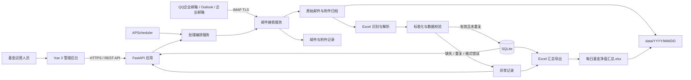
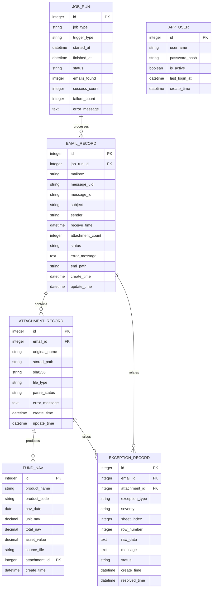

# 阶段 1：需求分析与架构设计

## 1. 建设目标

构建一套可在本地或 Docker 环境稳定运行的基金运营工具，实现“邮件接收 → 原件归档 → Excel 智能识别 → 数据标准化 → 校验去重 → 入库 → 异常留痕 → 汇总导出 → Web 查询”的闭环。

首版采用单体模块化架构：FastAPI 承载 API 与业务服务，APScheduler 在同一后端进程中调度任务，SQLite 持久化数据，Vue 3 提供管理页面。该方案部署简单、维护成本低，并保留后续拆分任务进程和迁移 PostgreSQL 的边界。

## 2. 核心业务规则

1. 邮箱连接参数、调度时间、归档路径等全部通过 YAML 与环境变量配置，密码优先由环境变量注入，禁止提交真实凭据。
2. 邮件初筛使用主题关键词、附件扩展名；最终是否为净值文件以工作表字段特征为准，不能只依赖文件名。
3. 原始邮件和附件先归档、后解析。归档失败时不进入解析流程，保证审计原件完整。
4. 三类 Excel 数据统一映射为产品名称、产品代码、日期、单位净值、累计净值、资产净值、来源文件、创建时间。
5. `产品代码 + 日期` 是净值数据的业务唯一键。同一文件重复执行必须幂等；不同文件提供相同业务键时记录重复异常，不覆盖历史数据。
6. 单个附件失败不能中断同一封邮件中其他附件；失败原因必须关联到邮件和附件，可人工上传后重试。
7. 金额与净值使用定点小数保存，不使用浮点数；日期按业务日期保存，系统时间统一保存为带时区时间。
8. 每次接收、解析、导出和人工重试均记录状态和错误，日志不得输出邮箱授权码等敏感信息。

## 3. 边界与非功能要求

- 稳定性：网络超时重试、附件级故障隔离、数据库事务、任务互斥、幂等写入。
- 安全性：本地登录、密码哈希、JWT 会话、上传文件类型和大小限制、路径净化、防止公式注入。
- 审计性：保存 `.eml` 原文、附件、来源文件名、邮件 UID、处理状态和异常记录。
- 可恢复性：SQLite 定期备份；归档目录和数据库均使用宿主机卷挂载。
- 可观测性：结构化滚动日志、任务运行记录、可读错误码；首页指标从数据库聚合。
- 兼容性：`.xlsx` 使用 openpyxl；旧 `.xls` 使用 xlrd 兼容读取。合并单元格、多行表头和标题行通过表头扫描处理。
- 性能目标：首版面向单机构本地运营，单次上千文件、百万级净值明细以内保持可用；超出后迁移 PostgreSQL 和独立任务进程。

## 4. 系统架构



### 4.1 模块职责

| 模块 | 职责 | 关键策略 |
|---|---|---|
| 邮件接收 | IMAP 连接、按 UID 拉取、下载附件 | TLS、超时重试、UID 幂等 |
| 归档 | 保存 EML、附件和导出文件 | 年/月/日分区、文件哈希、防路径穿越 |
| 文件识别 | 扫描工作表和候选表头 | 字段特征评分，不依赖文件名 |
| 解析适配器 | 解析三类净值表 | 每类独立适配器，统一输出 DTO |
| 标准化校验 | 字段映射、类型转换、业务校验 | Decimal、日期归一、异常分级 |
| 持久化 | 保存邮件、附件、净值、异常、任务 | 事务、唯一约束、不覆盖历史 |
| 导出 | 生成净值与异常两个 Sheet | 防 Excel 公式注入、原子替换 |
| Web API | 登录、列表、查询、上传重试、导出 | JWT、分页、参数校验 |
| 调度 | 每日任务和手工触发 | 单实例互斥、misfire 处理、运行记录 |

## 5. Excel 智能识别设计

解析器先遍历全部工作表，再扫描前 30 行寻找表头。字段会先去空格、换行和常见括号差异，再进行别名匹配。

| 类型 | 必需特征字段 | 映射说明 |
|---|---|---|
| 单基金每日净值表 | 资产代码、资产名称、资产份额净值 | 代码→产品代码，名称→产品名称，资产份额净值→单位净值，资产份额累计净值→累计净值 |
| 多基金汇总净值表 | 产品代码、产品名称、估值基准日、单位净值 | 直接映射；资产净值可选 |
| 资产净值浏览表 | 产品名称、产品代码、日期、资产净值、资产份额 | 单位净值、累计净值直接映射；资产份额用于辅助校验 |

若多个类型同时命中，按“必需字段命中数 + 专属字段权重”评分；仍并列则标记 `AMBIGUOUS_FORMAT`，不猜测入库。日期缺失、关键字段缺失、数值转换失败均进入异常表。

## 6. 数据库设计

### 6.1 实体关系



### 6.2 表设计说明

#### `fund_nav`

| 字段 | 类型 | 约束/索引 | 说明 |
|---|---|---|---|
| id | INTEGER | PK | 主键 |
| product_name | VARCHAR(255) | NOT NULL，索引 | 产品名称 |
| product_code | VARCHAR(64) | NOT NULL | 产品代码，入库前去首尾空格并统一大小写 |
| nav_date | DATE | NOT NULL，索引 | 估值日期 |
| unit_nav | NUMERIC(20,8) | 可空 | 单位净值 |
| total_nav | NUMERIC(20,8) | 可空 | 累计净值 |
| asset_value | NUMERIC(24,4) | 可空 | 资产净值 |
| source_file | VARCHAR(500) | NOT NULL | 原始附件名 |
| attachment_id | INTEGER | FK，可空 | 来源附件记录 |
| create_time | DATETIME | NOT NULL | 创建时间 |

唯一约束：`uq_fund_nav_product_code_nav_date(product_code, nav_date)`。历史日期记录不会被后续导入覆盖。

#### `email_record`

兼容需求给定字段，并将“每封邮件只有一个 attachment_name”的设计调整为邮件主表 + 附件子表，避免一封多附件导致重复邮件记录。为向前端展示保留 `attachment_count` 聚合字段。

唯一约束：`uq_email_mailbox_uid(mailbox, message_uid)`；`message_id` 仅作辅助审计，因为部分邮件可能缺失或重复。

#### `attachment_record`

保存每个附件的原名、归档路径、SHA-256、识别类型、解析状态和错误。哈希建立普通索引用于识别完全相同的附件；是否重复入库仍以净值业务键为最终判断。

#### `exception_record`

异常类型至少包括：`MISSING_DATE`、`MISSING_FIELD`、`EMPTY_NAV`、`DUPLICATE_NAV`、`INVALID_FORMAT`、`AMBIGUOUS_FORMAT`、`PARSE_ERROR`。记录 Sheet、行号和脱敏后的原始行，支持待处理、已解决、忽略状态。

#### `job_run`

用于任务互斥、运行审计和首页统计。应用启动时若发现超时的 `RUNNING` 任务，将其标记为失败后允许重新执行。

#### `app_user`

保存本地后台账号，只存安全哈希后的密码，不保存明文。用户名唯一；首个管理员账号通过初始化命令创建，避免在配置文件中放默认密码。

### 6.3 状态机

- 邮件：`DISCOVERED → ARCHIVED → PROCESSING → SUCCESS / PARTIAL_SUCCESS / FAILED / SKIPPED`
- 附件：`PENDING → ARCHIVED → PARSING → SUCCESS / FAILED / DUPLICATE / UNSUPPORTED`
- 异常：`OPEN → RESOLVED / IGNORED`

## 7. 归档目录

```text
data/
└── 2026/
    └── 07/
        └── 24/
            ├── emails/
            │   └── <mailbox>_<uid>.eml
            ├── attachments/
            │   └── <attachment-id>_<sanitized-original-name>.xlsx
            └── exports/
                └── 每日基金净值汇总_20260724.xlsx
```

临时下载和导出先写入同目录临时文件，校验完成后原子改名，避免留下半文件。

## 8. 目标项目目录

```text
fund-nav-automation/
├── README.md
├── .env.example
├── .gitignore
├── config/
│   └── config.example.yaml
├── docs/
│   └── stage-1-design.md
├── backend/
│   ├── pyproject.toml
│   ├── alembic.ini
│   ├── alembic/
│   ├── app/
│   │   ├── main.py
│   │   ├── api/
│   │   │   ├── deps.py
│   │   │   └── v1/
│   │   │       ├── auth.py
│   │   │       ├── dashboard.py
│   │   │       ├── emails.py
│   │   │       ├── navs.py
│   │   │       ├── exceptions.py
│   │   │       └── uploads.py
│   │   ├── core/
│   │   │   ├── config.py
│   │   │   ├── logging.py
│   │   │   ├── security.py
│   │   │   └── constants.py
│   │   ├── db/
│   │   │   ├── base.py
│   │   │   ├── session.py
│   │   │   └── models/
│   │   ├── schemas/
│   │   ├── repositories/
│   │   ├── services/
│   │   │   ├── email_service.py
│   │   │   ├── archive_service.py
│   │   │   ├── parser_service.py
│   │   │   ├── nav_service.py
│   │   │   └── export_service.py
│   │   ├── parsers/
│   │   │   ├── detector.py
│   │   │   ├── base.py
│   │   │   ├── single_fund.py
│   │   │   ├── fund_summary.py
│   │   │   └── asset_browser.py
│   │   ├── jobs/
│   │   │   ├── scheduler.py
│   │   │   └── daily_pipeline.py
│   │   └── utils/
│   └── tests/
│       ├── unit/
│       ├── integration/
│       └── fixtures/
├── frontend/
│   ├── package.json
│   ├── vite.config.ts
│   ├── src/
│   │   ├── api/
│   │   ├── router/
│   │   ├── stores/
│   │   ├── layouts/
│   │   ├── components/
│   │   └── views/
│   │       ├── LoginView.vue
│   │       ├── DashboardView.vue
│   │       ├── EmailListView.vue
│   │       ├── FundNavView.vue
│   │       └── ExceptionView.vue
│   └── tests/
├── data/
│   └── .gitkeep
├── logs/
│   └── .gitkeep
├── deploy/
│   ├── backend.Dockerfile
│   ├── frontend.Dockerfile
│   └── nginx.conf
└── docker-compose.yml
```

## 9. 关键接口边界（后续阶段实现）

- `POST /api/v1/auth/login`：后台登录。
- `GET /api/v1/dashboard/summary`：首页指标。
- `GET /api/v1/emails`、`GET /api/v1/emails/{id}`：邮件列表与详情。
- `GET /api/v1/navs`：按名称、代码、日期分页查询。
- `GET /api/v1/navs/{product_code}/curve`：历史净值曲线。
- `GET /api/v1/exceptions`：异常列表。
- `POST /api/v1/uploads/reparse`：人工上传并重新解析。
- `POST /api/v1/attachments/{id}/reparse`：对已归档附件重试。
- `GET /api/v1/exports/daily?date=YYYY-MM-DD`：生成或下载每日汇总。
- `POST /api/v1/jobs/mail-sync`：人工触发邮件同步。

## 10. 分阶段验收标准

阶段 1 通过后才进入阶段 2。后续每阶段都要求单元测试或集成测试覆盖核心路径，并在交付前实际运行验证。

1. 后端基础框架：配置、日志、数据库会话、健康检查、异常响应、测试框架可运行。
2. 邮箱读取：可配置 IMAP、UID 幂等、EML/附件归档、模拟邮箱测试通过。
3. Excel 解析：三类样例字段识别、标准化、多行表头/空值/错误测试通过。
4. 数据库存储：迁移、唯一约束、事务、重复异常、历史保留测试通过。
5. Excel 导出：两个 Sheet、字段顺序、异常内容、防公式注入验证通过。
6. Vue 后台：登录、概览、邮件、净值、异常页面和 API 联调通过。
7. Docker 部署：一条命令启动、健康检查、持久卷、重启后数据保留。

## 11. 已识别风险与决策

| 风险 | 决策 |
|---|---|
| APScheduler 与多 worker 导致重复任务 | 首版调度进程固定单 worker；API 扩容时拆出独立 scheduler 服务 |
| SQLite 并发写锁 | 短事务、WAL 模式、单写入编排；规模增长后迁移 PostgreSQL |
| `.xls` 无法由 openpyxl 读取 | 显式增加 xlrd；不通过伪装扩展名绕过格式判断 |
| 表头位置和名称存在细微差异 | 表头扫描、文本归一和可配置别名，不做无依据模糊猜测 |
| 同名附件覆盖 | 归档名包含附件记录 ID，原始名称单独保存 |
| 邮件重复拉取 | 邮箱标识 + IMAP UID 唯一；附件 SHA-256 辅助去重 |
| 产品代码缺失导致无法建立业务唯一键 | 记为缺少字段异常，不自动用产品名称替代代码入库 |
| 本地部署凭据泄漏 | `.env` 不入库、日志脱敏、示例配置只放占位符 |
